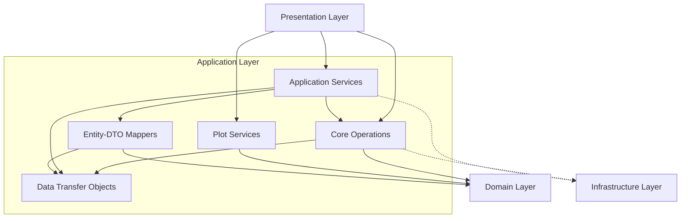

# Application Layer

## Overview

The **Application Layer** orchestrates business workflows and coordinates between the domain and infrastructure layers. It implements use cases, manages data flow, and provides services that the presentation layer consumes.

Following **Clean Architecture** principles, this layer:
- Depends on domain abstractions (not infrastructure details)
- Coordinates workflows without duplicating domain logic
- Uses dependency injection for testability
- Maintains clear boundaries between layers

## Architecture

## Module Structure

### 1. Core Operations (`application/core`)

**Purpose:** Implements core use case operations for file processing and data analysis.

**Modules:**

- `upload_handler.py` - File upload processing and validation
- `sample_parser.py` - Sample file parsing
- `data_processor.py` - Data merging and processing pipeline
- `result_exporter.py` - Multi-format result export (CSV, Excel, JSON)

**Key Features:**

- Circuit breaker pattern for resilience
- Timeout handling for long operations
- Multi-database merging (BioRemPP, KEGG, HADEG, ToxCSM)
- Comprehensive error handling

### 2. Data Transfer Objects (`application/dto`)

**Purpose:** Immutable data containers for transferring data between layers.

**DTOs:**

- `upload_result_dto.py` - Upload operation results
- `merged_data_dto.py` - Database merge results
- `validation_result_dto.py` - Validation outcomes
- `processing_progress_dto.py` - Progress tracking information

**Design Principles:**

- Frozen dataclasses (immutable)
- Type-safe with full annotations
- Validation in `__post_init__`
- No business logic

### 3. Mappers (`application/mappers`)

**Purpose:** Convert between domain entities and application DTOs.

**Mappers:**
- `sample_mapper.py` - Sample ↔ DataFrame conversions
- `merged_data_mapper.py` - MergedData ↔ MergedDataDTO conversions

**Characteristics:**

- Stateless (all static methods)
- Bidirectional mapping
- Preserves data integrity
- No data copying (shares references)

### 4. Application Services (`application/services`)

**Purpose:** Cross-cutting concerns and workflow orchestration.

**Services:**

- `cache_service.py` - Application-level caching with TTL
- `progress_tracker.py` - Multi-stage progress tracking
- `analysis_orchestrator.py` - Complete workflow orchestration

**Patterns:**

- Dependency injection
- Session management
- Weighted progress calculation (8 stages)
- Hash-based cache keys (SHA256)

### 5. Plot Services (`application/plot_services`)

**Purpose:** Plot generation with configuration and caching.

**Components:**

- `plot_service.py` - Main plot generation service
- `plot_factory.py` - Strategy pattern factory
- `plot_config_loader.py` - YAML configuration loader
- `singleton.py` - Thread-safe singleton pattern

**Features:**
- Multi-layer caching (DataFrame + Graph)
- 19 plot strategies registered
- YAML-based configuration
- Memory optimization (singleton reduces 37 instances → 1)

## Key Design Patterns

### Dependency Injection

All services use constructor injection for dependencies

### Circuit Breaker

Protects against cascading failures in data processing

### Strategy Pattern

Plot generation uses strategy pattern for extensibility

### Singleton Pattern

PlotService uses thread-safe singleton for memory efficiency

## Caching Strategy

### Application Cache

- **Type:** In-memory with TTL
- **Key:** SHA256 hash of content
- **Eviction:** FIFO when max size reached
- **Default TTL:** 3600 seconds (1 hour)

### Plot Cache

- **Layers:** 2-tier (DataFrame + Graph)
- **Keys:** Template-based with data/filter hashes
- **Benefits:** Reduces redundant plot generation

## Error Handling

Comprehensive error handling at each layer:

1. **Upload:** Validation errors with detailed messages
2. **Processing:** Circuit breaker prevents cascading failures
3. **Export:** Format-specific error handling
4. **Progress:** Error state tracking with session recovery

## Testing Considerations

All components designed for testability:

- **Dependency Injection:** Easy to mock dependencies
- **Stateless Services:** No hidden state
- **DTOs:** Simple data validation
- **Mappers:** Pure functions (static methods)

## Performance Optimizations

1. **Singleton PlotService:** 97% memory reduction (37 → 1 instance)
2. **Multi-layer Caching:** Reduces database queries and plot generation
3. **Weighted Progress:** Accurate time estimates
4. **Circuit Breaker:** Prevents resource exhaustion
5. **DataFrame Reference Sharing:** No unnecessary copying

## Dependencies

### Internal (Domain Layer)
- `domain.entities` - Sample, Dataset, MergedData
- `domain.value_objects` - SampleId, KO
- `domain.plot_strategies` - All 19 plot strategies

### Internal (Infrastructure Layer)
- `infrastructure.persistence` - Repository interfaces
- `infrastructure.cache` - Cache managers
- `infrastructure.config` - Configuration loaders

### External
- `pandas` - DataFrame operations
- `pyyaml` - Configuration loading
- Standard library - `dataclasses`, `typing`, `hashlib`, `time`