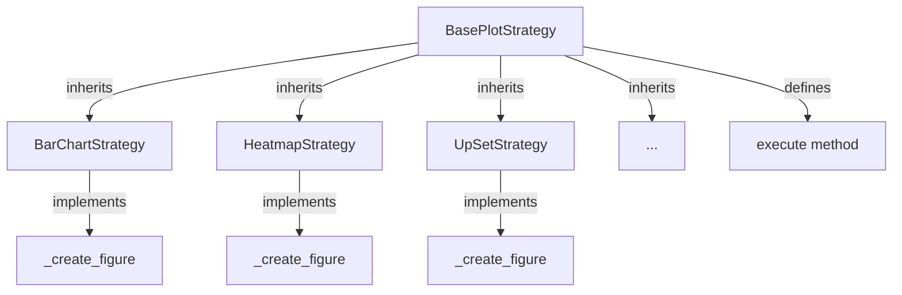

# Base Plot Strategy

The **Base Plot Strategy** defines the abstract base class for all plot strategy implementations in the Domain Layer.

## Overview

All plot strategies inherit from `BasePlotStrategy` which implements the **Template Method** design pattern.

## Documentation

- **[Base Plot Strategy Class](plot_strategies/base/base_plot_strategy.md)**: Abstract base class implementation

## Template Method Pattern

The base strategy provides:

1. **Common Interface**: All strategies share the same execution signature
2. **Hook Methods**: Subclasses override specific steps  
3. **Invariant Steps**: Base class handles common operations
4. **Flexible Extension**: Easy to add new plot types

### Pattern Structure

## Design Benefits

- **Code Reuse**: Common logic in base class
- **Consistency**: All strategies follow same pattern
- **Extensibility**: New strategies easily added
- **Maintainability**: Changes in one place affect all strategies
