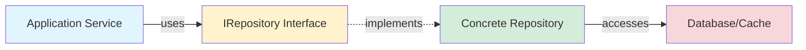

# Repository Interfaces
Repositories define **contracts for data persistence and retrieval**, following the **Repository Pattern** from Domain-Driven Design (DDD).

!!! note "Interface Pattern"
    The repository interfaces are currently in development. Concrete implementations will be added in the Infrastructure Layer following Clean Architecture principles.

---

## Repository Pattern Overview

### Benefits

1. **Separation of Concerns**: Domain logic independent of data access
2. **Testability**: Easy to mock for unit tests
3. **Flexibility**: Swap implementations without changing domain
4. **Clean Architecture**: Maintains dependency rule

### Architecture Flow

---

## Related Documentation

- [Domain Entities](entities.md) - Objects persisted by repositories

