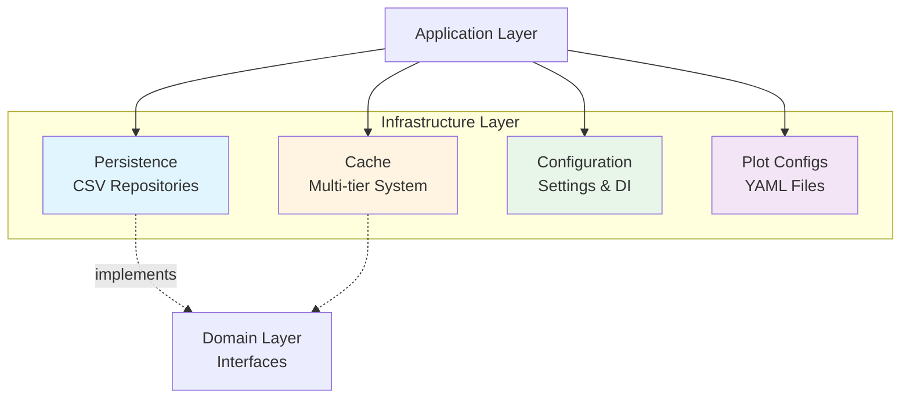
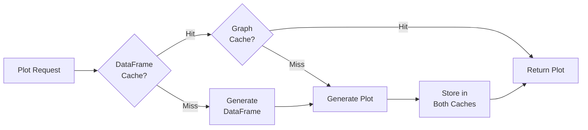

# Infrastructure Layer

## Overview

The **Infrastructure Layer** provides concrete implementations for external concerns like data persistence, caching, and configuration management. It implements the interfaces defined by the domain layer and provides the technical capabilities needed by the application layer.

Following **Clean Architecture** principles, this layer:
- Implements domain repository interfaces
- Provides caching mechanisms
- Manages application configuration
- Handles external dependencies (CSV files, YAML configs)
- Remains isolated from business logic

## Architecture



## Module Structure

### 1. Persistence (`infrastructure/persistence`)

**Purpose:** Data access layer for CSV-based databases.

**Components:**
- `csv_database_repository.py` - Generic CSV repository with caching
- `biorempp_repository.py` - BioRemPP database access
- `kegg_repository.py` - KEGG database access
- `hadeg_repository.py` - HADEG database access
- `toxcsm_repository.py` - ToxCSM database access

**Key Features:**

- Template Method Pattern (base repository with specialized implementations)
- Lazy Loading (databases loaded on first access)
- DataFrame Caching (in-memory caching for performance)
- Flexible Querying (support for single and batch KO lookups)
- Error Handling (graceful handling of missing files/data)

**Database Locations:**
```
biorempp_web/data/databases
├── biorempp_table.py  → BioRemPP data
├── kegg_table.py      → KEGG pathways
├── hadeg_table.py     → HADEG annotations
└── toxcsm_table.py    → ToxCSM predictions
```

### 2. Cache (`infrastructure/cache`)

**Purpose:** Multi-tier caching system for performance optimization.

**Cache Types:**

#### Memory Cache (`memory_cache.py`)

- **Type:** Generic in-memory cache
- **Features:** TTL, size limits, LRU eviction
- **Use Case:** General-purpose caching

#### DataFrame Cache (`dataframe_cache.py`)

- **Type:** Specialized for pandas DataFrames
- **Features:** Hash-based keys, memory-efficient
- **Use Case:** Database query results, merged data

#### Graph Cache (`graph_cache.py`)

- **Type:** Plotly figure caching
- **Features:** Serialization support, TTL
- **Use Case:** Generated plots and visualizations

#### Graph Cache Manager (`graph_cache_manager.py`)

- **Type:** Centralized cache orchestration
- **Features:** Multi-layer coordination, invalidation
- **Use Case:** Plot service caching strategy

**Caching Strategy:**



### 3. Configuration (`infrastructure/config`)

**Purpose:** Application settings and dependency injection.

**Components:**

#### Settings (`settings.py`)
- Singleton Pattern (single configuration instance)
- Environment Support (development, production, testing)
- **Features:**

  - Database paths configuration
  - Cache settings (TTL, sizes)
  - Logging configuration
  - Feature flags

#### Database Config (`database_config.py`)
- **Purpose:** Database connection and path management
- **Features:**

  - Path validation
  - Database availability checks
  - Lazy initialization
  - Error handling for missing databases

#### Dependency Injection (`dependency_injection.py`)
- **Pattern:** Service Locator + Factory
- **Features:**

  - Centralized dependency creation
  - Lifecycle management
  - Singleton services
  - Easy testing (mock injection)

#### Analysis Registry (`analysis_registry.py`)
- **Purpose:** Register and discover analysis strategies
- **Features:**

  - Strategy registration
  - Dynamic discovery
  - Metadata management
  - Validation

**Configuration Hierarchy:**

```
Settings (Singleton)
├── Database Config
│   ├── BioRemPP paths
│   ├── KEGG paths
│   ├── HADEG paths
│   └── ToxCSM paths
├── Cache Config
│   ├── TTL settings
│   ├── Size limits
│   └── Eviction policies
└── Application Config
    ├── Logging levels
    ├── Feature flags
    └── Environment settings
```

### 4. Plot Configurations (`infrastructure/plot_configs`)

**Purpose:** YAML-based plot configuration files.

**Structure:**
```
plot_configs/
├── module1/
│   ├── uc_1_1_config.yaml
│   ├── uc_1_2_config.yaml
│   └── ...
├── module2/
│   ├── uc_2_1_config.yaml
│   ├── uc_2_2_config.yaml
│   └── ...
├── module3/
│   └── ...
└── module4/
    └── ...
```

**Configuration Schema:**

```yaml
metadata:
  use_case_id: "UC-2.1"
  title: "Ranking of Samples by Functional Richness"
  description: "Bar chart showing KO count per sample"
  module: 2

visualization:
  strategy: "BarChartStrategy"
  type: "bar"
  
data:
  x_column: "Sample"
  y_column: "KO_Count"
  aggregation: "count"
  
layout:
  title: "Sample Functional Richness"
  xaxis_title: "Sample ID"
  yaxis_title: "Number of KOs"
  height: 600
  
cache:
  dataframe_ttl: 3600
  graph_ttl: 1800
  key_template: "uc_{use_case_id}_{data_hash}_{filters_hash}"
```

## Design Patterns

### Repository Pattern

All database access through repository interfaces

### Singleton Pattern

Configuration and services use singleton

### Template Method Pattern

Base repository defines algorithm, subclasses customize

### Strategy Pattern

Cache strategies for different data types

## Performance Optimizations

### 1. Multi-Tier Caching

**Impact:** 90%+ reduction in database reads

```
Request → L1 (Memory) → L2 (DataFrame) → L3 (Graph) → Database
```

### 2. Lazy Loading

**Impact:** Faster startup, lower memory footprint

- Databases loaded only when first accessed
- Configuration loaded on-demand
- Repositories initialized lazily

### 3. Batch Operations

**Impact:** 10x faster for multiple KO lookups

### 4. DataFrame Caching

**Impact:** Sub-millisecond retrieval vs. seconds for CSV parsing

- Hash-based cache keys
- TTL-based expiration
- LRU eviction when full

## Cache Configuration

### Default Settings

| Cache Type | Max Size  | TTL   | Eviction |
| ---------- | --------- | ----- | -------- |
| Memory     | 100 items | 3600s | LRU      |
| DataFrame  | 50 items  | 3600s | LRU      |
| Graph      | 30 items  | 1800s | LRU      |

### Cache Key Strategies

**DataFrame Cache:**
```python
key = f"{database}_{ko_hash}_{timestamp}"
```

**Graph Cache:**
```python
key = f"uc_{use_case_id}_{data_hash}_{filters_hash}"
```

## File Organization

```
infrastructure/
├── __init__.py
├── persistence/          # Data access layer
│   ├── __init__.py
│   ├── csv_database_repository.py
│   ├── biorempp_repository.py
│   ├── kegg_repository.py
│   ├── hadeg_repository.py
│   └── toxcsm_repository.py
├── cache/               # Caching system
│   ├── __init__.py
│   ├── memory_cache.py
│   ├── dataframe_cache.py
│   ├── graph_cache.py
│   └── graph_cache_manager.py
├── config/              # Configuration
│   ├── __init__.py
│   ├── settings.py
│   ├── database_config.py
│   ├── dependency_injection.py
│   ├── analysis_registry.py
│   └── download_config.yaml
└── plot_configs/        # Plot YAML configs
    ├── module1/         
    ├── module2/         
    ├── module3/         
    └── module4/         
```

## Version

**Current Version:** 1.0.0

## See Also

- Application Layer Documentation
- Domain Layer Documentation
- Data Tables Documentation
