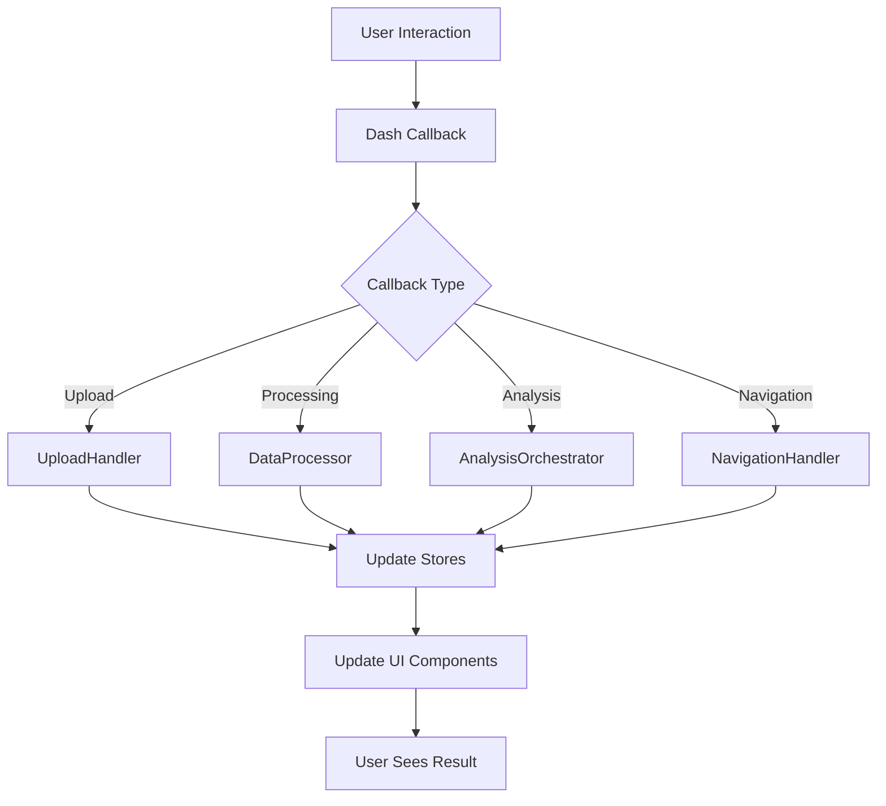

::: src.presentation.callbacks
    :docstring:
    :show-root-toc: false
    :show-source: false
    :heading-level: 2
:::

# Callbacks Layer
The **Callbacks Layer** implements Dash callback handlers that connect UI events to application logic, providing real-time interactivity for the BioRemPP platform.

# Callbacks Layer
The **Callbacks Layer** implements Dash callback handlers that connect UI events to application logic, providing real-time interactivity for the BioRemPP platform.

---

## Overview

Callbacks are the **heart of the Dash application**, handling user interactions and updating the UI dynamically. The BioRemPP callbacks layer follows a modular architecture organized by functional areas.

### Responsibilities

- **Event Handling**: Respond to user interactions (clicks, file uploads, selections)
- **State Management**: Update Dash stores and component properties
- **Application Integration**: Call Application Layer services and handlers
- **Progress Tracking**: Provide real-time feedback during long-running operations
- **Navigation**: Manage page navigation and routing

---

## Architecture

### Callback Structure

```
presentation/callbacks/
├── Core Callbacks (Global)
│   ├── upload_callbacks.py         # File upload handling
│   ├── processing_callbacks.py     # Data processing workflow
│   ├── navigation_callbacks.py     # Navigation and routing
│   ├── results_callbacks.py        # Results display
│   └── real_*.py                   # Real-data integration callbacks
│
├── Module Orchestrators
│   └── module_callbacks/
│       ├── module1_callbacks.py    # Module 1 orchestrator
│       ├── module2_callbacks.py    # Module 2 orchestrator
│       ├── ...
│       └── module8_callbacks.py    # Module 8 orchestrator
│
└── Use Case Callbacks (Specific)
    ├── module1/
    │   ├── uc_1_1_callbacks.py     # Database overlap analysis
    │   ├── uc_1_2_callbacks.py     # Regulatory overlap
    │   ├── ...
    │   └── uc_1_6_callbacks.py     # Sample-agency heatmap
    ├── module2/
    │   └── ...
    └── module3-8/
        └── ...
```

### Data Flow



---

## Core Callbacks

### Upload Callbacks

Handles file upload workflow and sample data validation.

**Key Functions**:
- File upload and parsing
- Sample data validation
- Upload result storage
- Validation feedback display

**Integration**: Uses `UploadHandler` from Application Layer.

**Stores Updated**:
- `upload-result-store`: Contains `UploadResultDTO`
- `sample-data-store`: Parsed sample data
- `validation-feedback-store`: Validation messages

---

### Processing Callbacks

Manages data processing workflow with real-time progress tracking.

**Key Functions**:
- Start/stop processing
- Progress updates
- Processing result storage
- Completion notifications

**Integration**: Uses `DataProcessor` and `ProgressTracker` from Application Layer.

**Stores Updated**:
- `processing-progress-store`: Progress percentage and status
- `merged-data-store`: Processed merged data
- `processing-status-store`: Success/error state

---

### Navigation Callbacks

Controls application navigation and scroll behavior.

**Key Functions**:
- Toggle offcanvas navigation
- Scroll to target sections
- Update URL hash
- Handle deep linking

**Stores Updated**:
- `url-store`: Current URL and hash
- `offcanvas-state-store`: Open/closed state

---

### Results Callbacks

Displays analysis results and visualizations.

**Key Functions**:
- Render result tables
- Display plot figures
- Export data triggers
- Result filtering

**Integration**: Uses `ResultExporter` from Application Layer.

**Stores Updated**:
- `results-display-store`: Formatted results
- `export-status-store`: Export completion status