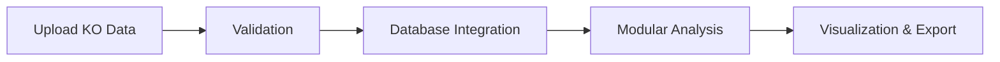

# BioRemPP Web Service

*Open-Access Scientific Platform for Bioremediation Functional Analysis*

**Version:** 1.0.3-beta | **Last Updated:** 2025-01-21

---

## Start Here

### Quick Links (Recommended)

<div class="grid cards" markdown>

-   :material-rocket-launch:{ .lg .middle } **Quickstart Guide**

    ---

    Get started in 3–5 minutes with a step-by-step tutorial

    [:octicons-arrow-right-24: Quickstart](getting-started/quickstart.md)

-   :material-file-document-edit:{ .lg .middle } **Input Format**

    ---

    Learn how to prepare your KO annotations by sample

    [:octicons-arrow-right-24: Input Format](getting-started/input-format.md)

-   :material-view-grid:{ .lg .middle } **Use Cases**

    ---

    Explore 8 modules with 56 analytical use cases

    [:octicons-arrow-right-24: Use Cases Index](use_cases/index.md)

-   :material-flask:{ .lg .middle } **Methods Overview**

    ---

    Understand the scientific methodology behind BioRemPP

    [:octicons-arrow-right-24: Methods](methods/methods-overview.md)

</div>

### Additional Resources

| Resource | Description |
|----------|-------------|
| [Validation & Limitations](validation/limitations.md) | Understanding scope and constraints |
| [How to Cite](about/how-to-cite.md) | Citation guidelines for publications |
| [Terms of Use](about/terms-of-use.md) | Usage policies and licensing |
| [Contact](about/contact.md) | Support and institutional contact |

!!! tip "For Scientific Reviewers"
    If you are evaluating BioRemPP as a scientific web server, start with **[Use Cases → Module 1 (UC 1.1)](use_cases/module1/uc_1.1.md)** and **[Methods Overview](methods/methods-overview.md)**.

---

## Overview

**BioRemPP** (Bioremediation Potential Profile) is an **open-access scientific web service** for exploratory, integrative functional analysis of bioremediation potential based on **KEGG Orthology (KO) identifiers**.

The platform integrates four curated databases with seven international regulatory frameworks to enable comprehensive assessment of functional capabilities relevant to environmental remediation contexts.

### Key Features

- :material-database-check: **Multi-database integration** — BioRemPP, KEGG, HADEG, toxCSM
- :material-chart-box: **56 analytical use cases** across 8 specialized modules
- :material-shield-check: **7 regulatory frameworks** — IARC, EPA, ATSDR, WFD, PSL, EPC, CONAMA
- :material-download: **Exportable results** — CSV, Excel, JSON formats
- :material-lock-open: **No registration required** — session-based, privacy-first design

!!! warning "Research Tool Disclaimer"
    BioRemPP is designed for **exploratory research** and hypothesis generation. It is **not** validated for clinical diagnostics, regulatory compliance, or direct remediation decisions without independent experimental validation.

---

## Target Audience

BioRemPP is designed for:

- **Bioinformatics researchers** developing analytical pipelines for metagenomics and functional annotation
- **Environmental biologists** conducting functional genomics research on bioremediation
- **Scientific reviewers** evaluating integrative database platforms and bioremediation workflows
- **Graduate students** exploring compound-centric functional analysis approaches

---

## Inputs and Outputs

### Inputs

BioRemPP accepts **KEGG Orthology (KO) identifiers** organized by sample.

| Requirement | Details |
|-------------|---------|
| **Format** | Plain text (`.txt`) with FASTA-like headers (`>SampleName`) |
| **Content** | KO identifiers (one per line under each sample header) |
| **Size limit** | 5 MB maximum |
| **Preprocessing** | KO annotations must be generated upstream (eggNOG, KEGG KAAS, KOfamScan) |

!!! note "BioRemPP does not perform"
    Sequence assembly, gene calling, or functional annotation. Users must generate KO identifiers before submission.

### Outputs

| Category | Description |
|----------|-------------|
| **Integrated tables** | Merged annotations from BioRemPP, HADEG, KEGG, and toxCSM |
| **Interactive visualizations** | 8 modules with 56 Plotly-based analytical charts |
| **Downloadable data** | CSV, Excel, and JSON export formats |

---

## Integrated Resources

<div class="grid cards" markdown>

-   :material-database:{ .lg .middle } **BioRemPP Database v1.0**

    ---

    Curated compound-centric mappings linking KO → genes → compounds → regulatory context

-   :material-dna:{ .lg .middle } **KEGG Database**

    ---

    Metabolic pathway annotations and functional definitions ([KEGG](https://www.kegg.jp/kegg/legal.html))

-   :material-oil:{ .lg .middle } **HADEG Database**

    ---

    Hydrocarbon and xenobiotic degradation pathways ([GitHub](https://github.com/jarojasva/HADEG))

-   :material-flask-outline:{ .lg .middle } **toxCSM Database**

    ---

    Computational toxicity predictions with 50+ endpoints ([toxCSM](https://biosig.lab.uq.edu.au/toxcsm/))

</div>

### Regulatory Frameworks

| Agency | Scope |
|--------|-------|
| **IARC** | International Agency for Research on Cancer |
| **EPA** | United States Environmental Protection Agency |
| **ATSDR** | Agency for Toxic Substances and Disease Registry |
| **WFD** | Water Framework Directive (EU) |
| **PSL** | Priority Substances List (Canada) |
| **EPC** | European Parliament Commission |
| **CONAMA** | National Environmental Council (Brazil) |

---

## High-Level Workflow



1. **Data submission** — Upload plain-text files with KO identifiers by sample
2. **Validation** — Format compliance, KO validation, structural constraints
3. **Database integration** — Cascading joins across BioRemPP, KEGG, HADEG, toxCSM
4. **Modular analysis** — Execute 56 use cases across 8 analytical modules
5. **Results** — Interactive charts, tables, and downloadable exports

---

## Data Policy & Privacy

| Policy | Implementation |
|--------|----------------|
| :material-account-off: **No accounts** | No registration, authentication, or profiles |
| :material-timer-sand: **Session-based** | Data discarded after 4 hours of inactivity |
| :material-shield-lock: **No persistent storage** | Files processed in-memory only |
| :material-share-off: **No data sharing** | Uploaded content never shared externally |
| :material-https: **Secure transport** | HTTPS/TLS encryption on production |

!!! info "Logging Policy"
    Only technical metadata is logged (IP, user-agent, errors). **Uploaded content is never logged**.

---

## Reproducibility & Availability

| Resource | Link |
|----------|------|
| :material-web: **Web Service** | [https://biorempp.cloud](https://biorempp.cloud) |
| :material-github: **Source Code** | [github.com/BioRemPP/biorempp_web](https://github.com/BioRemPP/biorempp_web) |
| :material-docker: **Docker Image** | Available for local/institutional deployment |
| :material-license: **License** | Apache-2.0 (code) / CC BY 4.0 (database) |

---

## Limitations & Scope

!!! warning "Important Considerations"

    - **Research-only** — Not validated for clinical, regulatory, or operational decisions
    - **Database-dependent** — Results constrained by integrated database coverage
    - **KO-level resolution** — Does not capture isoform or substrate specificity
    - **Computational toxicity** — toxCSM predictions require experimental validation
    - **Presence/absence only** — No quantitative expression or metabolic flux data

---

## Citation

### Web Service

```text
BioRemPP Development Team (2025). BioRemPP: Bioremediation Potential Profile 
Web Service (v1.0.3-beta). Available at: https://biorempp.cloud
```

??? note "BibTeX Format"
    ```bibtex
    @misc{biorempp2025,
      title={BioRemPP: Bioremediation Potential Profile Web Service},
      author={BioRemPP Development Team},
      year={2025},
      url={https://biorempp.cloud},
      note={Version 1.0.3-beta}
    }
    ```

---

## License Summary

| Component | License |
|-----------|---------|
| **Database Content** | [CC BY 4.0](https://creativecommons.org/licenses/by/4.0/) |
| **Source Code** | [Apache 2.0](https://www.apache.org/licenses/LICENSE-2.0) |
| **KEGG** | Academic free; commercial requires license |
| **HADEG** | Open access ([GitHub](https://github.com/jarojasva/HADEG)) |
| **toxCSM** | Open access for academic research |

---

## Contact & Support

### Get Help

| Channel | Details |
|---------|---------|
| :material-email: **Email** | [biorempp@gmail.com](mailto:biorempp@gmail.com) |
| :material-bug: **Bug Reports** | [GitHub Issues](https://github.com/BioRemPP/biorempp_web/issues) |
| :material-clock-outline: **Response Time** | ~5 business days |

??? info "Bug Report Template"
    When reporting issues, please include:
    
    1. BioRemPP version (from footer)
    2. Browser type and version
    3. Operating system
    4. Steps to reproduce
    5. Expected vs. observed behavior
    6. Example input file (if applicable)
    7. Screenshots or error messages

---

## Acknowledgments

**Institutional Support:**

- Federal University of Rio Grande do Norte (UFRN)
- Graduate Program in Bioinformatics (PPg-Bioinfo)
- Instituto Metrópole Digital (IMD)
- Laboratory of Molecular Biology and Genomics (LBMG–UFRN)

**Funding:** CNPq, CAPES

We acknowledge the developers of **KEGG**, **HADEG**, **toxCSM**, and the open-source communities behind **Python**, **Dash**, **Plotly**, and **Pandas**.

---

<div class="grid cards" markdown>

-   :material-rocket-launch:{ .lg .middle } **Ready to start?**

    ---

    [:octicons-arrow-right-24: Go to Quickstart](getting-started/quickstart.md)

-   :material-view-grid:{ .lg .middle } **Explore Use Cases**

    ---

    [:octicons-arrow-right-24: View All Modules](use_cases/index.md)

</div>
