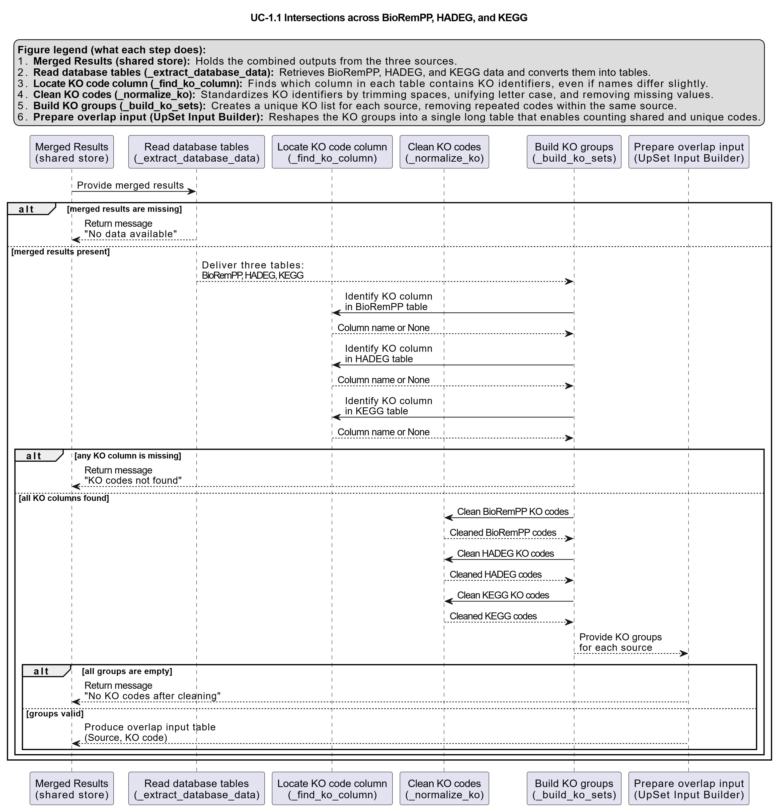

# UC-1.1 — Intersections across BioRemPP, HADEG, and KEGG

**Module:** 1 – Comparative Assessment of Databases, Samples, and Regulatory Frameworks  
**Visualization type:** UpSet plot (set intersections of KO identifiers)  
**Primary inputs:** BioRemPP, HADEG, KEGG KO annotation tables  
**Primary outputs:** Intersection cardinalities, UpSet visualization

---

## Scientific Question and Rationale

**Question:** To what extent do the functional annotations from different databases agree, and what unique contributions does each source provide for bioremediation-focused analysis?

This use case quantifies the overlap and uniqueness of KEGG Orthology (KO) identifiers across three distinct annotation sources:

- **BioRemPP:** A custom, compound-centric database integration tailored specifically for bioremediation studies.
- **HADEG:** A curated database focused on hydrocarbon degradation pathways.
- **KEGG:** A widely used reference database for broad metabolic pathway annotations.

By comparing these sources, the analysis assesses both the consensus signal (shared KO space) and the unique coverage contributed by each database, providing an empirical basis for evaluating the reliability and novelty of the BioRemPP pipeline.

---

## Data and Inputs

- **Annotation sources:** BioRemPP, HADEG, KEGG
- **Required identifier column:** `ko` (KO identifiers)
- **Accepted formats:** semicolon-delimited (`.txt` or `.csv`) tables
- **Identifier handling:** KOs are treated as strings and normalized prior to set operations

---

## Analytical Workflow

The generation of this plot follows a standardized computational pipeline:

1. **Data Loading and Parsing**  
   The result tables for BioRemPP, HADEG, and KEGG are loaded into memory.

2. **Identifier Standardization**  
   All KO identifiers are normalized (e.g., case and whitespace) to ensure accurate comparisons, and duplicate entries within each dataset are removed.

3. **Set Construction and Computation**  
   A unique set of KO identifiers is constructed for each database. From these sets, the following are computed:
   - The total number of unique KOs per database (set size).
   - The size of all pairwise intersections (e.g., BioRemPP ∩ HADEG).
   - The size of the triple intersection (BioRemPP ∩ HADEG ∩ KEGG).

4. **Rendering**  
   An UpSet plot is generated to visualize the size of all possible intersections, typically ranked by cardinality.

---

## How to Read the Plot

The UpSet plot is composed of three main components:

- **Set Size (Left Bar Chart)**  
  Shows the total number of unique KO identifiers found in each individual database.

- **Intersection Matrix (Bottom)**  
  The connected dots below the main chart define a specific intersection. For example, dots connected for BioRemPP and KEGG (but not HADEG) represent the set of KOs found only in those two databases.

- **Intersection Size (Top Bar Chart)**  
  The height of each bar corresponds to the number of KOs in the intersection defined by the matrix directly below it. Taller bars indicate a larger number of shared KO identifiers.

---

## Interpretation and Key Messages

- **Consensus Evidence**  
  A large bar above the triple intersection (all three dots connected) may represent strong consensus evidence for KO identifiers that are robustly identified across all sources.

- **Database-Specific Coverage**  
  Bars above single, unconnected dots may correspond to KO identifiers unique to one database. These patterns can suggest the specialized coverage of each source, such as HADEG's targeted focus or BioRemPP's novel compound-centric links.

- **Partial Agreement**  
  Bars above pairwise intersections suggest partial agreement and may reveal important differences in curation, scope, or mapping between databases (e.g., how synonyms are handled or how recently pathways were updated).

---

## Reproducibility and Assumptions

- **Input Format**  
  The analysis requires semicolon-delimited (`.txt` or `.csv`) tables containing a column for KO identifiers (named `ko`).

- **Identifier Normalization**  
  All KO identifiers are treated as strings and normalized (e.g., converted to uppercase, trimmed for whitespace) prior to set operations to ensure consistency.

- **Deduplication**  
  Duplicate KO entries within each source are removed before computing set sizes and intersections, so all counts correspond to unique identifiers.

 
---

## Activity diagram of the use case

