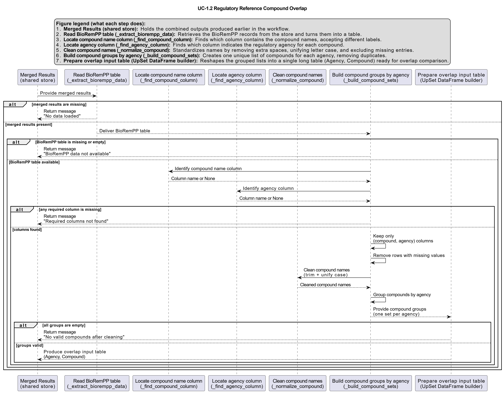

# UC-1.2 — Overlap of Compounds Across Regulatory References

**Module:** 1 – Comparative Assessment of Databases, Samples, and Regulatory Frameworks  
**Visualization type:** UpSet plot (set intersections of compound names)  
**Primary inputs:** BioRemPP results table (`BioRemPP_Results.xlsx or BioRemPP_Results.csv`)  
**Primary outputs:** Intersection cardinalities of compound lists across regulatory agencies, UpSet visualization

---

## Scientific Question and Rationale

**Question:** To what extent do the lists of monitored chemical compounds overlap between different environmental regulatory agencies, and which compounds are of consensual concern?

This use case quantifies the overlap and uniqueness of **compounds** across the different environmental and regulatory references (`referenceAG`) cited in the BioRemPP dataset. The UpSet plot provides a systematic view of which compounds are unique to the scope of a single agency versus those that are shared concerns across multiple regulatory bodies. This perspective can be useful for identifying widely recognized pollutants, locating regional or thematic specializations, and assessing the degree of harmonization between regulatory frameworks.

---

## Data and Inputs

- **Primary data source:** `BioRemPP_Results.xlsx or BioRemPP_Results.csv`
- **Key columns:**
  - `referenceAG` – identifier for the regulatory or scientific agency (e.g., WFD, CONAMA, EPC)
  - `compoundname` – name of the monitored chemical compound
- **Accepted format:** semicolon-delimited text table (`.txt` or `.csv`)
- **Entity of interest:** unique compound names per agency

---

## Analytical Workflow

1. **Data Loading**  
   The primary results table (`BioRemPP_Results.xlsx or BioRemPP_Results.csv`) is loaded into memory.

2. **Filtering and Cleaning**  
   The dataset is filtered to retain only complete entries containing both a non-empty `referenceAG` and `compoundname`. Compound names and agency identifiers are standardized (e.g., trimming whitespace, harmonizing case) to ensure consistent matching.

3. **Set Construction**  
   The cleaned data is grouped by each unique `referenceAG`. For every agency, a **set of all unique compound names** associated with it is constructed. These sets represent the compounds monitored or referenced by each regulatory body.

4. **Intersection Calculation and Rendering**  
   Using the per-agency compound sets, all relevant intersections (single, pairwise, and higher-order) are computed. An UpSet plot is then generated to visualize:
   - the size of each individual set, and  
   - the size of all intersections, typically ranked by cardinality.

---

## How to Read the Plot

The UpSet plot is composed of three main components:

- **Set Size (Left Bar Chart)**  
  Displays the total number of unique compounds associated with each individual regulatory agency (`referenceAG`). Larger bars indicate agencies with broader monitored chemical lists.

- **Intersection Matrix (Bottom)**  
  The connected dots in the matrix define a specific intersection of agencies. For example, dots connected for **"EPC"** and **"WFD"** (and not for others) represent the set of compounds that are monitored by both EPC and WFD, but not by the other agencies.

- **Intersection Size (Top Bar Chart)**  
  The height of each bar corresponds to the number of compounds in the intersection defined by the matrix directly below it. Taller bars indicate a larger number of shared compounds among the selected agencies.

---

## Interpretation and Key Messages

- **Consensus Compounds**  
  Large bars above intersections containing multiple agencies may represent sets of **"consensus compounds"** that are recognized across several regulatory frameworks. These compounds are likely to be well-studied pollutants and of broad environmental and policy relevance.

- **Agency-Specific Focus**  
  Bars above single, unconnected dots may correspond to compounds unique to a single agency's list. These patterns can suggest specialized regulatory scopes, such as regional priorities, specific industrial sectors, or targeted classes of pollutants (e.g., certain pesticides or industrial chemicals).

- **Consensus and Gaps**  
  The extent and structure of overlaps can provide insight into the level of consensus between different regulatory frameworks. Substantial overlaps may indicate convergent risk assessments or shared scientific baselines, whereas small or asymmetric overlaps can reveal differences in regional priorities, regulatory thresholds, or monitoring strategies.

---

## Reproducibility and Assumptions

- **Input Format**  
  The analysis assumes a semicolon-delimited table containing at least the columns `referenceAG` and `compoundname`.

- **Identifier Handling**  
  Compound names and agency identifiers are treated as strings and normalized (e.g., trimming whitespace, harmonizing case) prior to set construction to ensure consistent matching.

- **Uniqueness Definition**  
  All counts are based on **unique compound names** per agency. Duplicate entries within the same `referenceAG` group are removed before computing set sizes and intersections.

 
---

## Activity diagram of the use case

