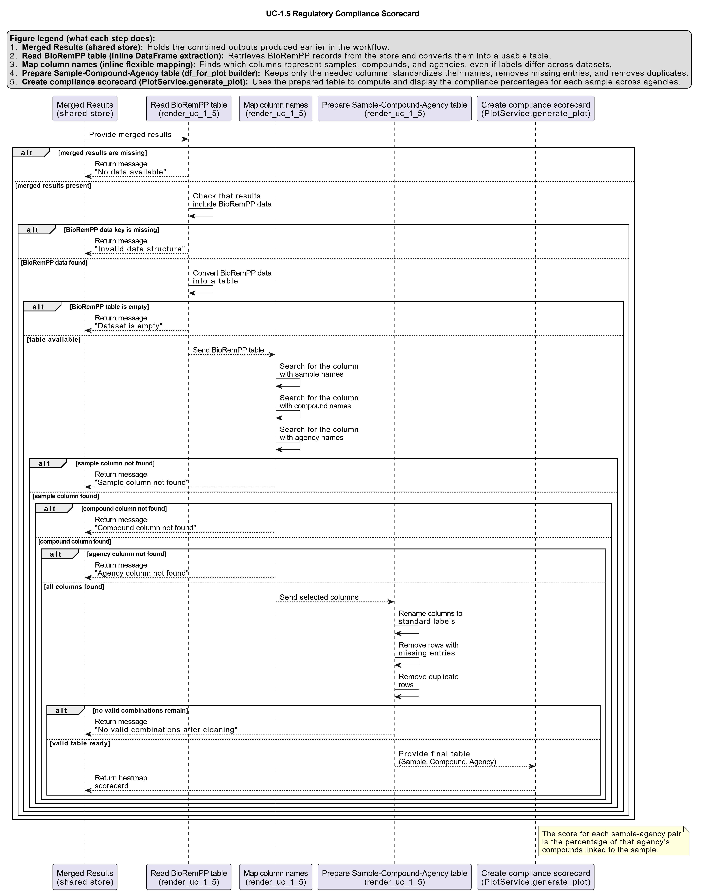

# UC-1.5 — Regulatory Reference Compliance Scorecard

**Module:** 1 – Comparative Assessment of Databases, Samples, and Regulatory Frameworks  
**Visualization type:** Heatmap (compliance scores of samples vs. regulatory agencies)  
**Primary inputs:** BioRemPP results table with `sample`, `referenceAG`, and `compoundname` columns  
**Primary outputs:** Compliance Score matrix (samples × regulatory agencies)

---

## Scientific Question and Rationale

**Question:** How "compliant" is the functional potential of each sample with the priorities of different regulatory bodies, as measured by the percentage of monitored compounds it can target?

This use case provides a practical, application-oriented **scorecard** that quantifies how well each sample's degradation capabilities align with the priorities of major regulatory agencies. The heatmap displays a computed **Compliance Score**, which reflects the percentage of an agency's target compounds that a given sample is functionally equipped to interact with. This perspective can be useful for evaluating candidate samples for deployment under specific regulatory frameworks or multi-agency scenarios.

---

## Data and Inputs

- **Primary data source:** `BioRemPP_Results.xlsx or BioRemPP_Results.csv`
- **Key columns:**
  - `sample` – identifier for each biological sample
  - `referenceAG` – identifier for the regulatory or scientific agency (e.g., WFD, CONAMA, EPC)
  - `compoundname` – name of the chemical compound associated with the interaction
- **Accepted format:** semicolon-delimited text table (`.txt` or `.csv`)
- **Entities of interest:**
  - **Samples:** biological sources with predicted interactions to compounds
  - **Regulatory agencies:** references defining sets of monitored or priority compounds

---

## Analytical Workflow

1. **Data Loading**  
   The primary results table (`BioRemPP_Results.xlsx or BioRemPP_Results.csv`) is loaded into memory from its semicolon-delimited format.

2. **Set Definition**  
   Two types of sets are constructed:
   - **Agency Compound Sets:**  
     For each unique `referenceAG`, a set is created containing all unique `compoundname` values it monitors.  
   - **Sample Compound Sets:**  
     For each unique `sample`, a set is created containing all unique `compoundname` values with which it is predicted to interact.

3. **Feature Engineering (Compliance Score)**  
   For every sample–agency pair, the **Compliance Score (%)** is computed as:

   `Compliance Score (%) = (shared_compounds / agency_compounds_total) * 100`

4. **Matrix Construction**  
   The calculated scores are pivoted into a 2D matrix where:
   - rows correspond to **Samples**,  
   - columns correspond to **Regulatory Agencies** (`referenceAG`), and  
   - each cell contains the Compliance Score (%) for that sample–agency pair.

5. **Rendering**  
   The resulting matrix is rendered as an interactive heatmap in which color intensity is proportional to the Compliance Score. Optional value annotations (e.g., numeric labels) can be overlaid in each cell.

---

## How to Read the Plot

- **Y-axis (Rows)**  
  Represents individual **Samples**.

- **X-axis (Columns)**  
  Represents the **Regulatory Agencies** included in the analysis.

- **Cell Color and Label**  
  The color intensity of each cell may indicate the **Compliance Score (%)**, with brighter or warmer colors corresponding to higher scores (better alignment). Where present, the numerical label inside the cell provides the exact percentage.

---

## Interpretation and Key Messages

- **High-Compliance Specialists**  
  Brightly colored cells ("hotspots") may indicate strong alignment between a specific sample and a specific agency. A sample with a high score for a given agency can be considered a potential **specialist** for meeting that agency's environmental standards.  
  For example, a score of 95% for *Sample A* and *Agency EPC* suggests that Sample A may be functionally equipped to target 95% of EPC's priority compounds.

- **Versatile Generalists**  
  A sample that shows consistently high scores across multiple agencies (i.e., a row with many high-intensity cells) may function as a **generalist**, offering broad regulatory relevance. Such samples could be particularly valuable in scenarios involving multiple overlapping regulatory frameworks.

- **Consortium Design and Coverage**  
  The scorecard can directly support **consortium design** decisions. To assemble a consortium for broad regulatory compliance, one might select a combination of samples whose high-scoring cells collectively cover the columns (agencies) of interest, balancing specialization and redundancy.

---

## Reproducibility and Assumptions

- **Input Format**  
  The analysis assumes a semicolon-delimited table containing at least the columns `sample`, `referenceAG`, and `compoundname`.

- **Score Definition**  
  The **Compliance Score** is a **normalized percentage**, enabling fair comparison across agencies that may monitor very different numbers of compounds.

- **Presence-Based Metric**  
  The score is based solely on the **presence** of predicted interactions between samples and compounds. It does not incorporate interaction strength, frequency, or underlying genetic diversity (e.g., number of genes or KOs per compound), which are treated in separate analyses.

- **Uniqueness Handling**  
  Sets are constructed from **unique compound** per sample and per agency. Duplicate occurrences of the same compound within a given sample or agency are ignored when computing intersections and totals.

 
---

## Activity diagram of the use case

