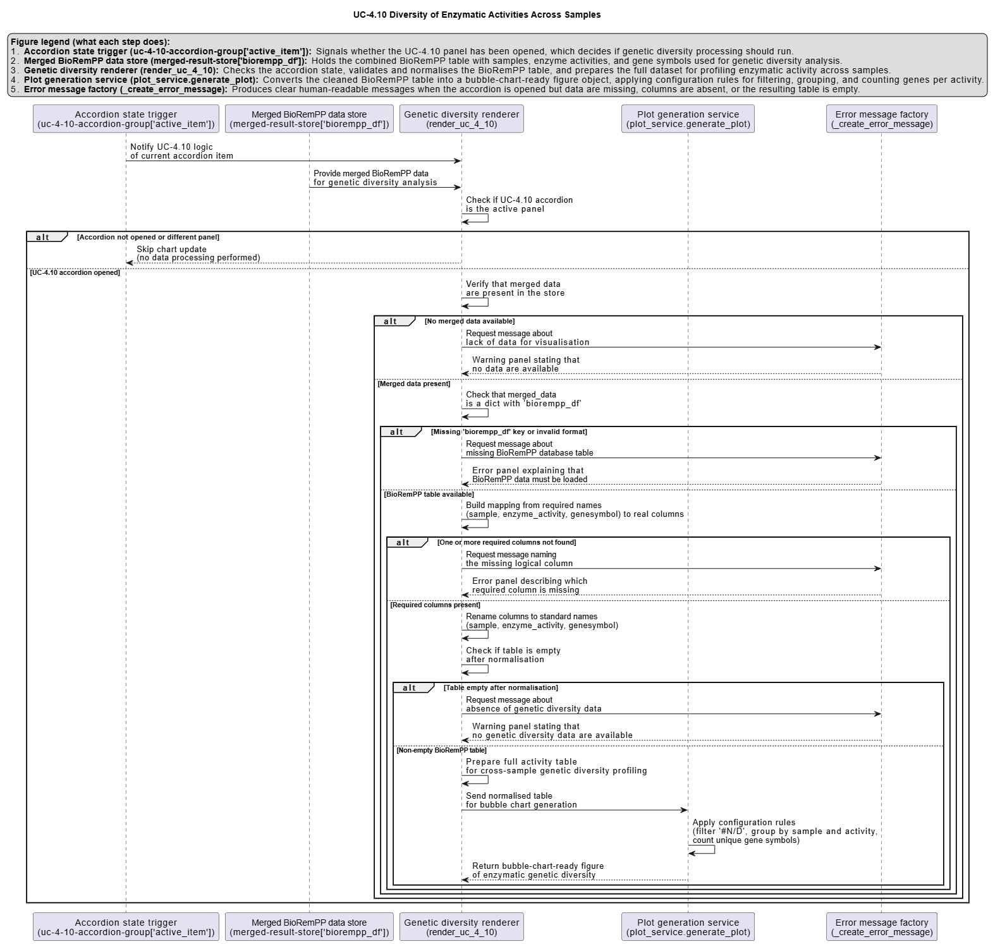

# UC-4.10 — Diversity of Enzymatic Activities Across Samples

**Module:** 4 – Functional and Genetic Profiling  
**Visualization type:** Bubble chart (enzyme activity vs. genetic diversity across samples)  
**Primary inputs:** `BioRemPP_Results.xlsx or BioRemPP_Results.csv` (sample–enzyme–gene associations)  
**Primary outputs:** Matrix of enzyme activities by samples with gene-diversity "hotspots"

---

## Scientific Question and Rationale

**Question:** Which enzymatic functions in which samples are supported by the greatest diversity of unique genes, indicating substantial genetic investment or functional redundancy?

The same enzymatic activity can be implemented by multiple, non-identical genes, forming **gene families** or parallel routes for the same function. Quantifying the number of **distinct gene symbols per enzyme activity per sample** may reveal:

- where each sample is investing most of its genetic resources, and  
- which enzymatic functions are particularly **robust**, **redundant**, or **specialized** across the consortium.

---

## Data and Inputs

- **Primary data source:** `BioRemPP_Results.xlsx or BioRemPP_Results.csv` (semicolon-delimited)

- **Key columns:**
  - `sample` – identifier for each biological sample  
  - `enzyme_activity` – enzymatic function label (e.g., *oxidoreductase*, *hydrolase*)  
  - `genesymbol` – gene symbols assigned to that enzymatic activity in each sample

- **Pre-processing rules:**
  - Remove rows with invalid or placeholder `enzyme_activity` labels (e.g., `#N/D`)  
  - Remove rows with missing `sample`, `enzyme_activity`, or `genesymbol`

- **Output structure:**
  - **X-axis:** enzymatic activities  
  - **Y-axis:** samples  
  - **Bubbles:** one bubble per `(sample, enzyme_activity)` pair, sized and colored by gene diversity

---

## Analytical Workflow

1. **Data Loading**  
   - Import the `BioRemPP_Results.xlsx or BioRemPP_Results.csv` table (semicolon-delimited) into the analysis environment.  
   - Ensure consistent column types for `sample`, `enzyme_activity`, and `genesymbol`.

2. **Data Cleaning**  
   - Filter out rows where:
     - `enzyme_activity` is invalid (e.g., `#N/D`) or missing, or  
     - `sample` or `genesymbol` is missing.  
   - Optionally standardize string fields (trim whitespace, harmonize case).

3. **Aggregation of Genetic Diversity**  
   - Group the cleaned data by `(sample, enzyme_activity)`.  
   - For each pair, compute the number of **distinct gene symbols**:
     - `unique_gene_count = nunique(genesymbol)`  
   - This yields a summary table with:
     - `sample`, `enzyme_activity`, `unique_gene_count`.

4. **Rendering the Bubble Chart**  
   - Map the summary table to a 2D scatter/bubble plot:
     - **X-axis:** `enzyme_activity`,  
     - **Y-axis:** `sample`,  
     - **Bubble size & color:** `unique_gene_count`.  
   - Add a color bar to show the quantitative scale of gene diversity.

---

## How to Read the Plot

- **Y-axis – Samples**  
  - Each horizontal position corresponds to a single **Sample**.

- **X-axis – Enzymatic Activities**  
  - Each vertical position represents an **Enzyme Activity** category detected in the dataset.

- **Bubbles – Genetic Diversity per Activity per Sample**  
  - Each bubble corresponds to one `(sample, enzyme_activity)` pair.  
  - **Bubble size** and **color intensity** both encode the **count of unique gene symbols** for that pair:
    - larger, brighter bubbles = higher gene diversity  
    - smaller, pale bubbles = lower gene diversity or sparse representation

- **Color Bar**  
  - The color bar on the side provides the numeric scale for `unique_gene_count`, allowing direct comparison across bubbles.

---

## Interpretation and Key Messages

- **Functional Hotspots**  
  - **Large, bright bubbles** may mark **hotspots of genetic diversity**:
    - the corresponding sample has many different genes supporting that specific enzymatic function, potentially suggesting high robustness, flexibility, or evolutionary importance of that activity.

- **Sample-Level Enzymatic Profiles**  
  - Reading **across a row** (fixed sample, varying enzyme activities) may reveal the **enzymatic fingerprint** of that sample:
    - a row with many large bubbles may mark a **functional powerhouse** with genetically diversified enzymatic capabilities  
    - a row with only a few large bubbles could point to more **focused specialization**

- **Function-Level Conservation and Variability**  
  - Reading **down a column** (fixed enzyme activity, varying samples) may reveal how that activity is distributed across the consortium:
    - a column with large bubbles in many samples may indicate a **widely diversified core function** (many samples, many genes)  
    - a column with one or few bubbles may indicate a **specialized or rare activity** restricted to specific samples

- **Implications for Consortium Design**  
  - Functions with:
    - **broad presence and high diversity** across samples may provide **robust, redundant coverage** in a consortium.  
  - Selecting complementary samples with different "hotspot" profiles can maximize **functional robustness and coverage**.

---

## Reproducibility and Assumptions

- **Input Format Requirements**  
  - The analysis assumes a semicolon-delimited file with at least:
    - `sample`,  
    - `enzyme_activity`,  
    - `genesymbol`.

- **Counting Rules**  
  - **Genetic diversity** is defined as the **number of unique gene symbols** per `(sample, enzyme_activity)` pair.  
  - Multiple rows representing the same `genesymbol` for the same sample and activity do **not** increase the count.

- **Scope and Limitations**  
  - The plot reflects **annotated gene diversity**, not measured expression levels or kinetic parameters.  

 
---

## Activity diagram of the use case

 