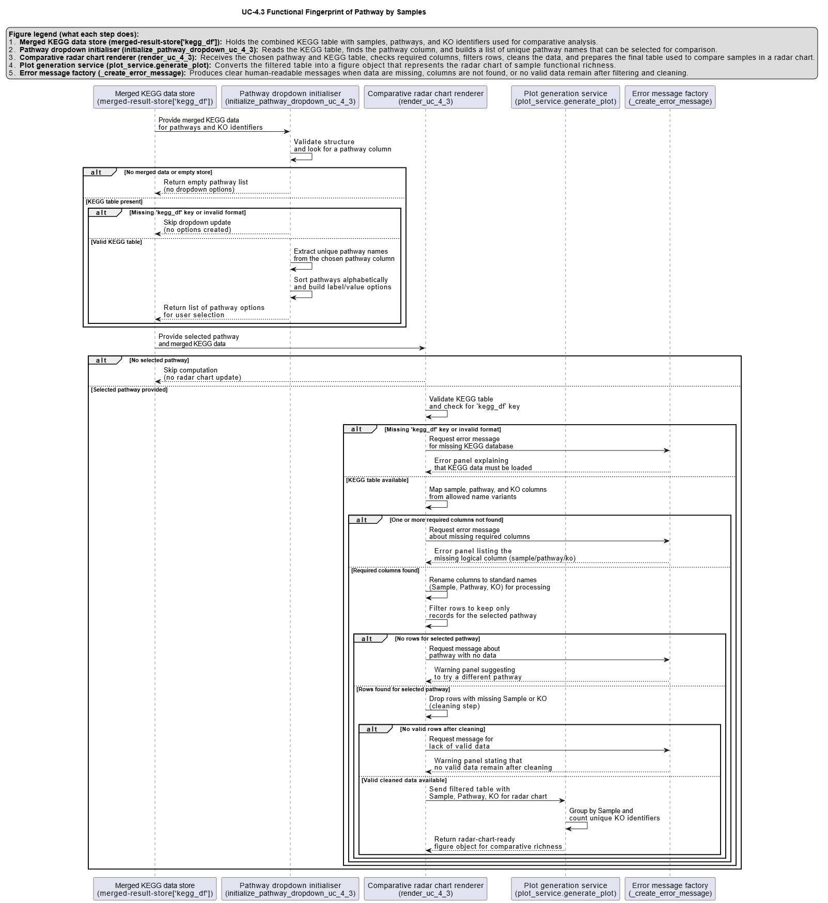

# UC-4.3 — Functional Fingerprint of Pathway by Samples

**Module:** 4 – Functional and Genetic Profiling  
**Visualization type:** Interactive radar (polar) plot (sample-level KO richness for a selected pathway)  
**Primary inputs:** `KEGG_Results.xlsx or KEGG_Results.csv` (sample–KO–KEGG pathway associations)  
**Primary outputs:** Polar "functional footprint" of a selected pathway across all samples

---

## Scientific Question and Rationale

**Question:** For a given metabolic pathway, what is the relative functional richness of each sample, and which samples are the key functional players?

This use case focuses on a **pathway-centric** view: for a selected KEGG pathway, it compares **all samples simultaneously** in terms of the number of unique KEGG Orthology (KO) identifiers they encode for that pathway.

Instead of a Cartesian bar chart, the analysis uses a **radar (polar) plot** to provide an intuitive, shape-based representation of the **functional footprint** of a pathway across the entire panel of samples. This can enable rapid visual identification of:

- **dominant contributors** (samples that concentrate most of the KO richness), and  
- **balanced vs. skewed** distributions of functional capacity across the consortium.

---

## Data and Inputs

- **Primary data source:** `KEGG_Results.xlsx or KEGG_Results.csv` (semicolon-delimited)  
- **Key columns:**
  - `sample` – identifier for each biological sample  
  - `pathname` – KEGG pathway name or identifier  
  - `ko` – KEGG Orthology (KO) identifier associated with that sample and pathway  

- **User control:**
  - A **dropdown menu** for selecting a single **metabolic pathway** (`pathname`) to analyze.

- **Output structure:**
  - **Axes (θ):** one axis per `sample`, arranged around the circle  
  - **Radius (r):** for each axis, the unique KO count for the selected pathway in that sample  
  - **Polygon:** a closed shape connecting all sample points, representing the pathway's distribution of functional richness across the consortium

---

## Analytical Workflow

1. **Pathway Selection (User Input)**  
   The user selects a **metabolic pathway** from an interactive dropdown menu.  
   - This selection corresponds internally to a specific `pathname` value.

2. **Dynamic Filtering**  
   - The KEGG results table `KEGG_Results.xlsx or KEGG_Results.csv` is loaded.  
   - The dataset is filtered to retain only rows where:
     - `pathname` matches the selected pathway, and  
     - `sample` and `ko` are valid and non-missing.

3. **Aggregation of KO Richness per Sample**  
   - The filtered data is grouped by `sample`.  
   - For each sample, the **number of distinct KO identifiers** is computed (e.g., via `nunique()` on `ko`).  
   - This yields a vector of `(sample, unique_ko_count)` values describing pathway-specific KO richness for each sample.

4. **Rendering as Radar (Polar) Plot**  
   - Each sample is mapped to an angular coordinate (θ) around the circle.  
   - The corresponding **radius (r)** for each sample is the unique KO count.  
   - A closed polygon is drawn by connecting the points in order, optionally with markers at each vertex:
     - axes: samples  
     - radius: pathway-specific KO richness

---

## How to Read the Plot

- **Dropdown Menu (Pathway Selection)**  
  - Use the menu to select the **Metabolic Pathway** of interest.  
  - The radar plot recomputes and updates automatically for the chosen pathway.

- **Axes (θ – Samples)**  
  - Each radial axis emanating from the center corresponds to one **Sample**.  
  - All samples involved in the selected pathway are arranged around the circle.

- **Radius (r – KO Richness)**  
  - The **distance from the center** along a given axis represents the **count of unique KOs** that sample contributes to the selected pathway.  
  - Larger radius values indicate greater pathway-specific KO richness.

- **Polygon Shape (Functional Footprint)**  
  - The polygon connecting all sample points encodes the **overall distribution of functional capacity** for that pathway across the consortium:
    - a **symmetrical, evenly expanded** shape may indicate more balanced contributions  
    - a **skewed shape** stretched towards one or a few axes may highlight dominant contributors

---

## Interpretation and Key Messages

- **Functional Strength of Individual Samples**  
  - Points further from the center on a given axis may represent **higher functional richness** for that sample in the selected pathway.  
  - These high-radius samples could be interpreted as **key functional specialists** for that metabolic route.

- **Identifying Key Functional Players**  
  - If the radar polygon is heavily skewed towards particular axes, it may indicate that a small subset of samples carries most of the KO repertoire for the selected pathway.  
  - Such samples could be prime candidates when designing **pathway-focused interventions** or **minimal consortia**.

- **Comparative Pathway Analysis Across the Consortium**  
  - By switching between different pathways via the dropdown, users can observe how **functional roles shift**.

- **Complementarity vs. Concentration**  
  - A radar plot where several axes reach similar radii may suggest a pathway whose KO repertoire is **broadly distributed** across samples, potentially supporting **functional redundancy** and robustness.  
  - Conversely, a plot where only one or two axes reach high values may suggest that the pathway is **concentrated in few samples**, indicating potential vulnerability but also clear **keystone candidates**.

---

## Reproducibility and Assumptions

- **Input Format**  
  The analysis requires a semicolon-delimited KEGG results table with at least:
  - `sample`,  
  - `pathname`,  
  - `ko`.

- **Definition of Pathway Richness**  
  - For each sample, pathway richness is defined as the **count of unique KOs** annotated to the selected pathway.  
  - Multiple occurrences of the same `(sample, pathname, ko)` combination do **not** increase the count.

- **Scope and Limitations**  
  - The metric reflects **genetic potential** (presence of annotated KOs), not expression levels, regulatory control, or actual metabolic flux.  
  - Radar plots are most interpretable when the number of samples (axes) is moderate; very large sample sets may require pre-filtering or grouping for clarity.

 
---

## Activity diagram of the use case

