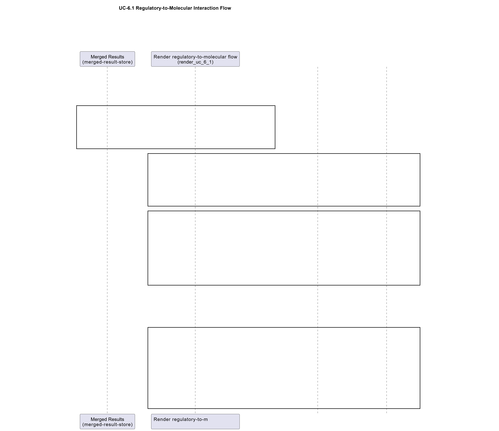

# UC-6.1 — Regulatory-to-Molecular Interaction Flow

**Module:** 6 – Hierarchical and Flow-based Functional Analysis  
**Visualization type:** Four-stage alluvial / Sankey diagram  
**Primary inputs:** BioRemPP results table with `referenceAG`, `sample`, `genesymbol`, and `compoundname`  
**Primary outputs:** Multi-stage flow network from regulatory agencies → samples → genes → compounds

---

## Scientific Question and Rationale

**Question:** How do high-level regulatory contexts cascade through specific samples and their genetic machinery to target individual chemical compounds?

This use case connects **regulatory priorities** to **molecular actions** by tracing complete paths from environmental or regulatory agencies, through **biological samples**, down to **genes** and ultimately **compounds**. By representing these connections as an **alluvial diagram** with four ordered stages, the analysis quantifies which regulatory frameworks are most strongly linked to which samples, which genes are most frequently deployed under those contexts, and which chemical targets emerge as key endpoints. The width of each flow encodes how frequently a given path appears, which can provide a **system-level view** of how regulation, biology, and chemistry are integrated in the dataset.

---

## Data and Inputs

- **Primary data source:** `BioRemPP_Results.xlsx or BioRemPP_Results.csv`  
- **Key columns:**
  - `referenceAG` – regulatory or scientific agency label  
  - `sample` – identifier for each biological sample  
  - `genesymbol` – gene symbol or identifier  
  - `compoundname` – chemical compound name or identifier  
- **Accepted format:** semicolon-delimited text table (`.txt` or `.csv`)

- **Conceptual flow (stages):**  
  1. **Regulatory Agency** (`referenceAG`)  
  2. **Sample** (`sample`)  
  3. **Gene Symbol** (`genesymbol`)  
  4. **Compound Name** (`compoundname`)

---

## Analytical Workflow

1. **Data Loading**  
   The primary results table (`BioRemPP_Results.xlsx or BioRemPP_Results.csv`) is loaded from its semicolon-delimited format.

2. **Path Definition**  
   A four-stage path is defined for each row using:
   - `referenceAG` → `sample` → `genesymbol` → `compoundname`.  
   Each complete combination represents a single **regulatory-to-molecular interaction path**.

3. **Aggregation of Flows**  
   The data is grouped by each **unique four-step path**:
   - for every unique `(referenceAG, sample, genesymbol, compoundname)` combination,  
   - the number of occurrences is counted.  
   This **count** becomes the **flow value** that determines ribbon thickness.

4. **Link Construction for Sankey / Alluvial Diagram**  
   The aggregated paths are transformed into a set of linked pairs suitable for a Sankey diagram:
   - **Stage 1 → Stage 2:** `referenceAG` → `sample`  
   - **Stage 2 → Stage 3:** `sample` → `genesymbol`  
   - **Stage 3 → Stage 4:** `genesymbol` → `compoundname`  
   Node indices and link values are encoded in the format required by the plotting library.

5. **Rendering**  
   The data is rendered as an **interactive alluvial (Sankey) diagram**:
   - vertical columns represent the four stages,  
   - nodes within each column represent unique entities at that stage,  
   - ribbons between columns represent aggregated flows weighted by their counts.

---

## How to Read the Plot

- **Vertical Columns (Stages)**  
  From left to right, the four columns represent:
  1. **Regulatory Agencies**  
  2. **Samples**  
  3. **Gene Symbols**  
  4. **Compound Names**

- **Nodes within Columns**  
  Each node is a unique entity at that stage:
  - a specific agency, sample, gene, or compound.  
  Node size (height) is proportional to the **total flow** entering or leaving that node.

- **Flows (Ribbons)**  
  The ribbons connecting nodes represent **flows of interactions**:
  - a ribbon from an agency to a sample may indicate that the sample participates in functions relevant to that agency's monitored compounds,  
  - a ribbon from a sample to a gene may indicate that the gene is deployed by that sample,  
  - a ribbon from a gene to a compound may indicate that the gene is associated with that compound.

- **Flow Thickness**  
  The **thickness** of each ribbon is proportional to the **number of co-occurrences** (the aggregated count for that partial path).  
  Thicker ribbons may indicate **more frequently observed** regulatory-to-molecular relationships.

- **Interactivity**  
  In the interactive version:
  - hovering over nodes or flows displays labels and numeric values (counts),  
  - nodes may be dragged vertically to improve visual separation of overlapping flows.

---

## Interpretation and Key Messages

- **Tracing Dominant Pathways**  
  The **thickest ribbons** may highlight the most prominent regulatory-to-molecular pathways:
  - from a given **Regulatory Agency** through one or more **Samples**,  
  - via specific **Genes**,  
  - down to their target **Compounds**.  
  These flows may capture where regulatory priorities and biological capabilities most strongly coincide.

- **Identifying Key Samples and Genes**  
  - A **large sample node** with many incoming and outgoing flows may indicate a **central biological actor** that connects multiple agencies to multiple genes and compounds.  
  - A **large gene node** that aggregates flows from many samples to many compounds may suggest a **versatile or essential gene**, potentially a key enzymatic or regulatory element.

- **Regulatory Footprint on the Molecular Landscape**  
  By following flows from left to right, one may observe:
  - which agencies exert the strongest influence on the observed genetic and chemical interactions,  
  - and which compounds ultimately constitute the main **regulatory endpoints** in the system.

- **System-Level Organization**  
  The diagram can provide an **overview**:
  - it visually integrates policy, biological agents, genetic mechanisms, and chemical targets into a single representation,  
  - potentially enabling the identification of bottlenecks, redundancies, and opportunities for **targeted bioremediation strategies** aligned with regulatory frameworks.

---

## Reproducibility and Assumptions

- **Input Format**  
  The analysis assumes a semicolon-delimited table containing at least the columns:
  - `referenceAG`, `sample`, `genesymbol`, and `compoundname`.

- **Flow Definition**  
  - Each unique `(referenceAG, sample, genesymbol, compoundname)` combination contributes a unit count to the corresponding path.  
  - The **strength of a flow** (ribbon thickness) is defined as the **total count of co-occurrences** for that path in the raw data.

- **Scope and Limitations**  
  - The alluvial diagram encodes **frequency of observation**, not kinetic rates, toxicity levels, or regulatory severity.  
  - It should be interpreted as a **structural mapping** of how regulatory contexts, samples, genes, and compounds are linked, serving as a guide for more detailed downstream analyses rather than a complete risk or performance assessment on its own.

 
---

## Activity diagram of the use case

