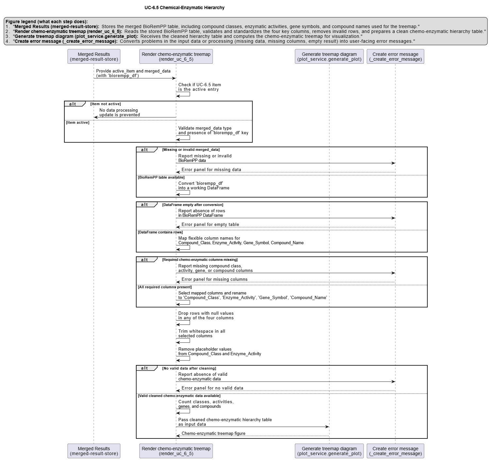

# UC-6.5 — Chemical–Enzymatic Hierarchy

**Module:** 6 – Hierarchical and Flow-based Functional Analysis  
**Visualization type:** Treemap (three-level hierarchical composition)  
**Primary inputs:** BioRemPP results table with `compoundclass`, `enzyme_activity`, `genesymbol`, and `compoundname`  
**Primary outputs:** Hierarchical partitioning of substrate scope across chemical classes → enzyme activities → genes

---

## Scientific Question and Rationale

**Question:** For each class of chemical compounds, which enzymatic functions are most commonly employed, and which specific genes are the most versatile in targeting the widest range of substrates within that class?

This use case provides a **chemical-first, top-down view** of the **functional landscape**. Starting from broad **compound classes**, it traces how these classes are processed by different **enzyme activities**, which are in turn implemented by specific **genes** encoded in the available biological samples. By quantifying, for each branch, the number of **unique compounds** involved, the treemap may highlight which combinations of chemical class, enzymatic function, and gene correspond to the **broadest substrate scope** and thus could represent **dominant degradation strategies** in the system.

---

## Data and Inputs

- **Primary data source:** `BioRemPP_Results.xlsx or BioRemPP_Results.csv`  
- **Key columns:**
  - `compoundclass` – high-level chemical class or category  
  - `enzyme_activity` – functional label for the enzymatic activity  
  - `genesymbol` – gene symbol or identifier associated with that activity  
  - `compoundname` – specific compound name or identifier
- **Accepted format:** semicolon-delimited text table (`.txt` or `.csv`)

- **Hierarchical structure:**
  1. **Compound Class** (`compoundclass`)  
  2. **Enzyme Activity** (`enzyme_activity`)  
  3. **Gene Symbol** (`genesymbol`)

---

## Analytical Workflow

1. **Data Loading**  
   The primary results table (`BioRemPP_Results.xlsx or BioRemPP_Results.csv`) is loaded from its semicolon-delimited format.

2. **Hierarchy Definition**  
   A three-level hierarchy is defined:
   - **Level 1:** `compoundclass`  
   - **Level 2:** `enzyme_activity` (nested within each class)  
   - **Level 3:** `genesymbol` (nested within each enzyme activity)

3. **Aggregation of Substrate Scope**  
   The data is grouped by each unique `(compoundclass, enzyme_activity, genesymbol)` path:
   - for each group, the number of **distinct `compoundname`** entries is computed (e.g., via `nunique()`),  
   - this count represents the **substrate scope** (number of unique compounds) associated with that gene under that class–activity context.

4. **Value Propagation for Treemap**  
   The unique compound counts at the lowest level (per gene) are used as the basic **values**:
   - higher-level values for `enzyme_activity` and `compoundclass` nodes are obtained by **summing** the values of all nested nodes,  
   - this yields total substrate scope at each level of the hierarchy.

5. **Rendering**  
   The aggregated data is rendered as an **interactive treemap**:
   - each rectangle represents a node in the hierarchy (compound class, enzyme activity, gene),  
   - the **area** of the rectangle is proportional to its total unique compound count,  
   - **color** is also mapped to the unique compound count to reinforce the visual encoding.

---

## How to Read the Plot

- **Nested Rectangles (Hierarchy)**  
  The treemap uses nested rectangles to represent:
  - **Outer rectangles:** **compound classes** (`compoundclass`),  
  - within each class, **inner rectangles:** **enzyme activities** (`enzyme_activity`),  
  - within each activity, the smallest rectangles: **genes** (`genesymbol`).

- **Area (Values)**  
  The **area** of each rectangle is proportional to the **total number of unique compounds**:
  - for a **gene node**, area reflects how many distinct compounds that gene is associated with within a specific class and activity,  
  - for an **enzyme activity node**, area reflects the total unique compounds targeted by all genes under that activity in that class,  
  - for a **compound class node**, area reflects the full substrate scope across all activities and genes.

- **Color Encoding**  
  Rectangle color also encodes the unique compound count:
  - brighter or warmer colors indicate **broader substrate scope**,  
  - cooler colors indicate a more limited set of compounds.

- **Interactivity**  
  In the interactive view:
  - clicking on a rectangle **zooms in** to that part of the hierarchy,  
  - hovering shows labels (compound class, enzyme activity, gene) and their associated **unique compound counts**.

---

## Interpretation and Key Messages

- **Dominant Degradation Strategies by Class**  
  The largest top-level rectangles may identify **compound classes** that:
  - are associated with the broadest enzymatic and genetic coverage,  
  - could represent **major bioremediation targets** in the dataset.

- **Key Enzymatic Functions within Classes**  
  Within each compound class, the largest **enzyme activity** rectangles may highlight:
  - the **primary functional mechanisms** employed to process that class,  
  - for example, whether oxidation, hydrolysis, or other activities dominate.

- **Versatile "Powerhouse" Genes**  
  At the lowest level, large **gene** rectangles may identify **versatile genes**:
  - genes that target many distinct compounds within a given class–activity context,  
  - potential **core genetic components** to prioritize when designing or engineering consortia for specific chemical classes.

- **Comparative Functional Architecture**  
  Overall, the treemap may reveal:
  - how enzymatic and genetic functions are distributed across chemical classes,  
  - which combinations of class, activity, and gene are most central to **substrate coverage**,  
  - and where there may be **gaps** (small or absent rectangles) indicating limited functional coverage for certain combinations.

---

## Reproducibility and Assumptions

- **Input Format**  
  The analysis assumes a semicolon-delimited table containing:
  - `compoundclass`, `enzyme_activity`, `genesymbol`, and `compoundname`.

- **Value Definition**  
  - The fundamental value driving the visualization is the **count of unique compound names** per `(compoundclass, enzyme_activity, genesymbol)` group.  
  - Higher-level node values are computed as **sums** of these counts across nested nodes.

- **Interpretation Scope**  
  - Unique-compound count is used as a **proxy for functional versatility or substrate scope**; it does not encode enzyme kinetics, expression levels, or in situ performance.  
  - The treemap should be interpreted as a **structural and comparative map** of where enzymatic and genetic breadth is concentrated within the chemical space of interest.

 
---

## Activity diagram of the use case

