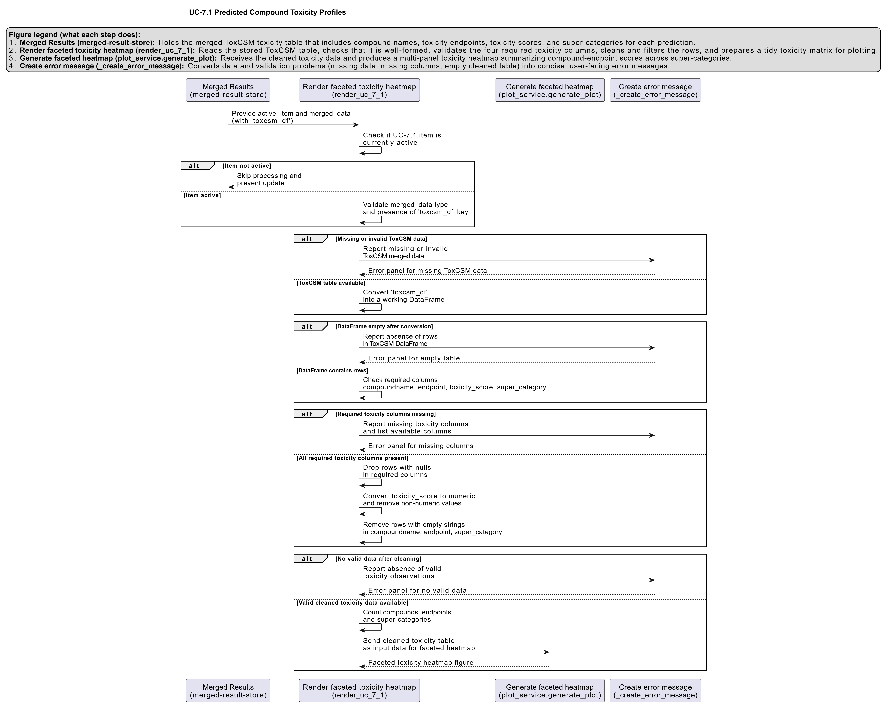

# UC-7.1 — Predicted Compound Toxicity Profiles

**Module:** 7 – Toxicological Risk Assessment and Profiling  
**Visualization type:** Faceted heatmap (compound × toxicological endpoints, grouped by super-category)  
**Primary inputs:** ToxCSM results table (`ToxCSM.xlsx or ToxCSM.csv`) with paired `value_` and `label_` columns  
**Primary outputs:** Per-compound toxicity "fingerprints" across multiple endpoints and super-categories

---

## Scientific Question and Rationale

**Question:** What is the comprehensive toxicological profile of each chemical compound across a wide range of risk categories, and which compounds pose the most significant and multi-endpoint hazards?

This use case provides a detailed **toxicological fingerprint** for each compound analyzed by the ToxCSM model. Rather than focusing on a single endpoint, the faceted heatmap integrates predictions across numerous toxicological endpoints, which are grouped into five major super-categories. This design can enable a direct, compound-centric comparison of specific risk patterns, potentially highlighting substances that are hazardous in multiple dimensions (e.g., genomic, environmental, organic) and therefore particularly relevant for prioritization in bioremediation planning and sample/consortium design.

---

## Data and Inputs

- **Primary data source:** `ToxCSM.xlsx or ToxCSM.csv` (semicolon-delimited)  
- **Key columns:**
  - `compoundname` – name of the chemical compound
  - `value_*` – numerical toxicity scores predicted by ToxCSM (e.g., `value_Gen_Carcinogenesis`)
  - `label_*` – qualitative categories corresponding to each score (e.g., "High", "Low", "Non-toxic")
- **Derived fields:**
  - `endpoint` – specific toxicological endpoint (e.g., `Gen_Carcinogenesis`)
  - `supercategory` – grouped toxicity domain (e.g., `Genomic`)
- **Toxicity super-categories:**
  - Nuclear Response  
  - Stress Response  
  - Genomic  
  - Environmental  
  - Organic  

---

## Analytical Workflow

1. **Data Loading**  
   The raw ToxCSM results table (`ToxCSM.xlsx or ToxCSM.csv`) is loaded from its semicolon-delimited format.

2. **Data Transformation (Pivoting to Long Format)**  
   The wide-format input, containing multiple `value_` and `label_` columns, is reshaped into a **long, tidy format**. In the processed table:
   - each row corresponds to a single `(compoundname, endpoint)` pair,  
   - with associated numeric toxicity score and qualitative label.

3. **Endpoint Categorization**  
   Each specific endpoint (e.g., `Gen_Carcinogenesis`, `Env_Toxicity`) is mapped to one of the five broader **toxicological super-categories** (e.g., `Genomic`, `Environmental`). This mapping is stored in a lookup structure and applied to all rows.

4. **Aggregation of Duplicate Entries**  
   When multiple raw entries exist for the same `(compoundname, endpoint)` pair (e.g., due to different runs or conditions), the data is:
   - grouped by `compoundname` and `endpoint` (and/or `supercategory`)

5. **Rendering**  
   The aggregated data is rendered as **faceted heatmaps**:
   - one facet (subplot) per **super-category**,  
   - within each facet, rows represent **Compounds** and columns represent **Endpoints** belonging to that super-category,  
   - cell color intensity encodes the averaged numeric toxicity score.

---

## How to Read the Plot

- **Facets (Subplots)**  
  Each of the five subplots represents a major **Toxicity Super-category**: Nuclear Response, Stress Response, Genomic, Environmental, or Organic.

- **Y-axis (Rows)**  
  Represents individual **Compounds** (`compoundname`).

- **X-axis (Columns)**  
  Represents specific **Toxicological Endpoints** within the corresponding super-category.

- **Cell Color**  
  The color intensity of each cell indicates the **predicted toxicity score** (typically on a 0–1 scale or analogous normalized range).  
  - Darker or warmer colors (e.g., reds) indicate **higher predicted risk**,  
  - lighter colors indicate **lower predicted risk**.

- **Hover Information (Interactive Mode)**  
  Hovering over a cell reveals:
  - the compound name,  
  - the specific endpoint,  
  - the numerical toxicity score, and  
  - its qualitative label (e.g., "High Toxicity", "Low Toxicity").

---

## Interpretation and Key Messages

- **Compound Risk Fingerprint**  
  Reading **across a row** can provide a comprehensive toxicological "fingerprint" for a single compound. This may facilitate identification of compounds that pose **multi-faceted hazards**, such as those predicted to be both carcinogenic and environmentally toxic.

- **High-Concern Endpoints**  
  **Columns that are consistently dark** across many compounds within a facet may  indicate endpoints that are frequently predicted as high-risk for the chemicals in this dataset. These endpoints could represent systemic vulnerabilities requiring particular attention in risk management and remediation strategy design.

- **Prioritizing "Problem" Compounds**  
  Compounds with **numerous high-intensity cells** (especially spanning multiple facets) might be considered **high-priority pollutants**, as they are predicted to be hazardous across several biological and environmental dimensions. These compounds may be natural candidates for targeted bioremediation efforts and for selecting or engineering samples/consortia with appropriate mitigation capabilities.

- **Comparative Risk Profiling**  
  By comparing patterns across rows and facets, users may distinguish:
  - compounds that are broadly toxic across many domains,  
  - compounds with localized risk profiles (e.g., primarily genomic or primarily environmental), and  
  - compounds with relatively benign predictions.

---

## Reproducibility and Assumptions

- **Input Format**  
  The workflow assumes a semicolon-delimited `ToxCSM.xlsx or ToxCSM.csv` table containing paired `value_*` (numeric) and `label_*` (qualitative) columns for each endpoint.

- **Endpoint–Category Mapping**  
  The assignment of endpoints to the five super-categories is based on a predefined mapping. Any changes to this mapping will alter which endpoints appear in each facet but not the underlying scores.

- **Model Dependency**  
  All toxicity scores originate from the ToxCSM predictive model. The visualization assumes that the model's output is internally calibrated and comparable across endpoints, but it does not account for experimental validation, dose–response relationships, or exposure scenarios, which must be evaluated separately.

 
---

## Activity diagram of the use case

