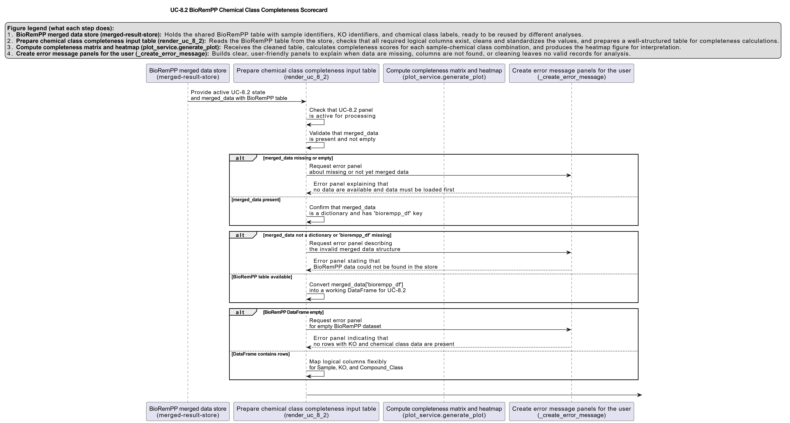

# UC-8.2 — BioRemPP Chemical Class Completeness Scorecard

**Module:** 8 – Assembly of Functional Consortia  
**Visualization type:** Interactive heatmap (Completeness Score per sample–class pair)  
**Primary inputs:** `BioRemPP_Results.xlsx or BioRemPP_Results.csv` (sample–KO–compound class associations)  
**Primary outputs:** Matrix of per-sample **Completeness Scores** for each chemical class

---

## Scientific Question and Rationale

**Question:** Which samples possess the most "complete" genetic toolkit for a given chemical class, and how can this be used to identify elite functional specialists?

Rather than simply asking whether a sample can interact with any compound from a class, the analysis quantifies **how complete** the sample's functional repertoire is for that class. This is achieved through a **Completeness Score**, which measures the fraction of all KEGG Orthology (KO) identifiers observed for a chemical class (within the dataset) that are present in a specific sample. The resulting scorecard can provide a quantitative basis for selecting **elite specialists** and assessing which classes may require **consortia** rather than single-sample solutions.

---

## Data and Inputs

- **Primary data source:** `BioRemPP_Results.xlsx or BioRemPP_Results.csv` (semicolon-delimited)  
- **Key columns:**
  - `sample` – identifier for each biological sample  
  - `ko` – KEGG Orthology (KO) identifier  
  - `compoundclass` – chemical class associated with the KO–sample interaction  

- **Scorecard structure:**
  - **Rows:** Samples  
  - **Columns:** Compound Classes  
  - **Cell value:** Completeness Score (%) for a given `(sample, compoundclass)` pair  

---

## Analytical Workflow

1. **Data Loading**  
   The primary results table `BioRemPP_Results.xlsx or BioRemPP_Results.csv` is loaded from its semicolon-delimited format.

2. **Feature Engineering – Completeness Score**  
   The Completeness Score is computed in three steps:
   - For each `compoundclass`, determine the **universe of unique KOs** observed across all samples.  
   - For each `(sample, compoundclass)` pair, count the **number of unique KOs** that the sample possesses for that class.  
   - Compute the **Completeness Score (%)** as:  
     `Completeness Score = (unique KOs in sample for that class / total unique KOs for that class) × 100`.

3. **Matrix Construction**  
   The per-pair Completeness Scores are reshaped into a **2D matrix**:
   - **rows** represent `sample`,  
   - **columns** represent `compoundclass`,  
   - **cell values** store the corresponding Completeness Score (%).

4. **Rendering as Heatmap**  
   The matrix is rendered as an **interactive heatmap**:
   - color intensity is proportional to the Completeness Score,  
   - numeric labels (optional) can be overlaid in each cell to show the exact percentage.

---

## How to Read the Plot

- **Y-axis (Rows)**  
  Each row corresponds to a single **Sample**.

- **X-axis (Columns)**  
  Each column corresponds to a **Compound Class** defined in the BioRemPP dataset.

- **Cells (Color and Label)**  
  - The **color intensity** of each cell encodes the **Completeness Score (%)** for that sample–class pair.  
  - Brighter or warmer colors indicate **higher completeness**, while darker or cooler colors indicate **lower completeness**.  
  - If enabled, the **numeric label** in the cell shows the exact percentage value.

---

## Interpretation and Key Messages

- **Identifying Elite Specialists**  
  Brightly colored cells ("hotspots") may denote **elite specialist** samples for specific chemical classes:
  - a score close to **100%** means the sample contains **all KOs** observed for that class in the entire dataset,  
  - such samples could be strong candidates for **single-sample solutions** for that chemical class.

- **Comparing Functional Potential Across Classes**  
  Reading **across a row** (left to right) may reveal the **functional range** of a given sample:
  - multiple high-scoring cells may indicate a **versatile degrader**, capable of handling several classes with near-complete toolkits,  
  - a row with only one or two hotspots may suggest a **highly specialized** sample.

- **Assessing Chemical Class Difficulty**  
  Reading **down a column** (top to bottom) may reveal how well a given class is covered:
  - if **no sample** reaches a high Completeness Score, the class could be intrinsically **difficult** or **distributed**,  
  - such classes are likely to require **consortia**, combining multiple samples to achieve full functional coverage.

- **Guiding Consortium Design**  
  By combining:
  - high-scoring **specialists** for difficult classes, and  
  - versatile samples with broad moderate scores,  
  users can design consortia that may be both **efficient** and **functionally complete** across the chemical space of interest.

---

## Reproducibility and Assumptions

- **Input Format**  
  The analysis requires a semicolon-delimited BioRemPP results table with at least the columns:
  - `sample`,  
  - `ko`,  
  - `compoundclass`.

- **Definition of KO Universe**  
  For each `compoundclass`, the **"total universe"** of KOs is defined **solely by the dataset**:
  - it is the set of all unique KOs observed for that class across all samples in `BioRemPP_Results.xlsx or BioRemPP_Results.csv`,  
  - no external canonical or exhaustive KO reference is used.

- **Normalization**  
  The Completeness Score is expressed as a **percentage**, allowing for fair comparison between classes that differ in their total KO counts (e.g., simple vs. complex classes).

- **Data Consistency**  
  Interpretation assumes:
  - consistent use of `sample`, `ko`, and `compoundclass` identifiers,  
  - no major annotation biases that selectively omit pathways for particular samples or classes.

- **Modeling Scope**  
  The Completeness Score reflects **genetic potential** (KO presence), not kinetic performance, expression levels, or environmental constraints. It should be interpreted as a **structural capacity metric**, complementary to other functional and toxicological analyses in BioRemPP.

 
---

## Activity diagram of the use case

