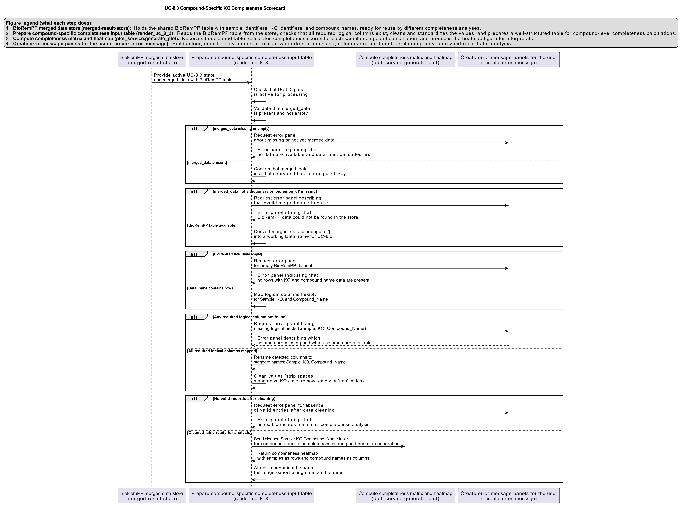

# UC-8.3 — Compound-Specific KO Completeness Scorecard

**Module:** 8 – Assembly of Functional Consortia  
**Visualization type:** Interactive heatmap (KO Completeness Score per sample–compound pair)  
**Primary inputs:** `BioRemPP_Results.xlsx or BioRemPP_Results.csv` (sample–KO–compound associations)  
**Primary outputs:** Matrix of per-sample **KO Completeness Scores** for individual compounds

---

## Scientific Question and Rationale

**Question:** For any given chemical compound, which sample possesses the most "complete" genetic toolkit (KO profile) for its degradation?

This use case provides the most **fine-grained** view of functional potential in BioRemPP. Instead of working at the chemical class level, the analysis is performed **compound by compound**, computing a **KO Completeness Score** that quantifies, for each sample, what fraction of the KEGG Orthology (KO) repertoire associated with a specific compound (within the dataset) is present in that sample. The resulting scorecard can enable precise identification of **elite specialists** for individual pollutants and may clarify which compounds are likely to require **multi-sample consortia** for complete degradation.

---

## Data and Inputs

- **Primary data source:** `BioRemPP_Results.xlsx or BioRemPP_Results.csv` (semicolon-delimited)  
- **Key columns:**
  - `sample` – identifier for each biological sample  
  - `ko` – KEGG Orthology (KO) identifier  
  - `compoundname` – chemical compound associated with the KO–sample interaction  

- **Scorecard structure:**
  - **Rows:** Samples  
  - **Columns:** Individual Compound Names  
  - **Cell value:** KO Completeness Score (%) for each `(sample, compoundname)` pair  

---

## Analytical Workflow

1. **Data Loading**  
   The primary BioRemPP results table `BioRemPP_Results.xlsx or BioRemPP_Results.csv` is loaded from its semicolon-delimited format.

2. **Feature Engineering – KO Completeness Score**  
   For each compound, a three-step procedure is applied:

   1. **KO Universe per Compound**  
      For each `compoundname`, determine the **universe of unique KOs** associated with that compound across all samples in the dataset.

   2. **Sample-Specific KO Count**  
      For each `(sample, compoundname)` pair, count the **number of unique KOs** that the sample possesses for that compound.

   3. **Score Calculation**  
      Compute the **KO Completeness Score (%)** as:  
      `KO Completeness Score = (unique KOs in sample for that compound / total unique KOs for that compound) × 100`.

3. **Matrix Construction**  
   The per-pair scores are reshaped into a **2D matrix**:
   - **rows** represent `sample`,  
   - **columns** represent `compoundname`,  
   - **cell values** store the KO Completeness Score (%).

4. **Rendering as Heatmap**  
   The matrix is rendered as an **interactive heatmap**:
   - color intensity is proportional to the KO Completeness Score,  
   - optional numeric labels in cells can display the exact percentage.

---

## How to Read the Plot

- **Y-axis (Rows)**  
  Each row corresponds to a single **Sample**.

- **X-axis (Columns)**  
  Each column corresponds to an individual **Compound Name**.

- **Cells (Color and Optional Label)**  
  - The **color intensity** of each cell encodes the **KO Completeness Score (%)** for that sample–compound pair.  
  - Brighter or warmer colors indicate a **more complete KO repertoire** for that compound.  
  - If enabled, numeric labels provide the exact percentage.

---

## Interpretation and Key Messages

- **Identifying Elite Specialists for Specific Compounds**  
  Brightly colored cells ("hotspots") may highlight **elite specialist** samples for individual compounds:
  - a **100% score** indicates that the sample possesses **all KOs** associated with that compound in the dataset,  
  - such samples could be prime candidates for **targeted degradation** of that specific pollutant.

- **Profiling Sample Capabilities at Compound Resolution**  
  Reading **across a row** may reveal a high-resolution profile of a sample's degradation capabilities:
  - a sample with high scores for several distinct compounds could be viewed as a **multi-target specialist**,  
  - a sample with a hotspot for only one or two compounds could be a **niche specialist**, potentially critical for those specific pollutants.

- **Assessing Degradation Complexity per Compound**  
  Reading **down a column** may reveal how difficult a compound is to fully address:
  - if no sample achieves a high KO Completeness Score, the compound may require a **division of labor**,  
  - this may suggest that **consortia**, combining complementary KO repertoires from multiple samples, will be necessary for complete pathway coverage.

- **Prioritization for Experimental Design**  
  The score card can be used to:
  - prioritize **single-sample experiments** for compounds with clear elite specialists, and  
  - design **multi-sample experiments** for compounds with fragmented KO coverage.

---

## Reproducibility and Assumptions

- **Input Format**  
  The analysis requires a semicolon-delimited BioRemPP results table containing at least:
  - `sample`,  
  - `ko`,  
  - `compoundname`.

- **Definition of KO Universe**  
  For each compound, the **"total universe"** of KOs is defined **by the dataset itself**:
  - it includes all unique KOs observed for that compound across all samples in `BioRemPP_Results.xlsx or BioRemPP_Results.csv`,  
  - no external canonical or exhaustive KO reference is used.

- **Normalization**  
  The KO Completeness Score is expressed as a **percentage**, enabling meaningful comparison:
  - across compounds that differ in their total KO counts, and  
  - across samples with varying overall annotation densities.

- **Interpretation Scope**  
  As with the class-level scorecard (UC-8.2), KO Completeness reflects **genetic potential**, not kinetic parameters, gene expression levels, or environmental regulation. It should be interpreted as a **structural capacity metric** to be integrated with other BioRemPP analyses when designing and evaluating bioremediation strategies.

 
---

## Activity diagram of the use case

