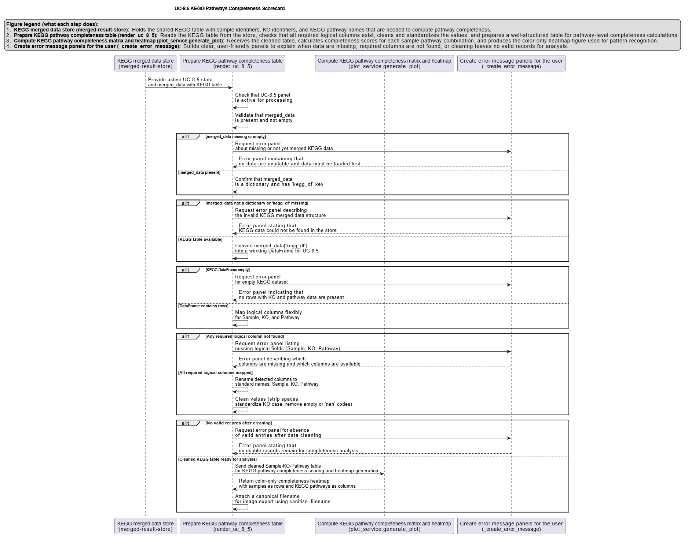

# UC-8.5 — KEGG Pathways Completeness Scorecard

**Module:** 8 – Assembly of Functional Consortia  
**Visualization type:** Interactive heatmap (Pathway Completeness Score per sample–pathway pair)  
**Primary inputs:** `KEGG_Results.xlsx or KEGG_Results.csv` (sample–KO–KEGG pathway associations)  
**Primary outputs:** Matrix of per-sample **Pathway Completeness Scores** for KEGG metabolic pathways

---

## Scientific Question and Rationale

**Question:** Which samples possess the most "complete" genetic toolkit for a given KEGG metabolic pathway, and how can this be used to identify elite functional specialists?

This use case extends the completeness framework to the **KEGG metabolic pathway space**. For each KEGG pathway, the analysis quantifies what fraction of its **KEGG Orthology (KO) repertoire** (as observed in the dataset) is present in a given sample. The resulting **Pathway Completeness Score** (in %) may allow identification of **elite pathway specialists**, characterization of broad **metabolic generalists**, and detection of pathways that likely require **multi-sample consortia** to achieve full functional coverage.

---

## Data and Inputs

- **Primary data source:** `KEGG_Results.xlsx or KEGG_Results.csv` (semicolon-delimited)  
- **Key columns:**
  - `sample` – identifier for each biological sample  
  - `ko` – KEGG Orthology (KO) identifier  
  - `pathname` – KEGG pathway name or identifier associated with the KO  

- **Scorecard structure:**
  - **Rows:** Samples  
  - **Columns:** KEGG Pathways (`pathname`)  
  - **Cell value:** Pathway Completeness Score (%) for each `(sample, pathname)` pair  

---

## Analytical Workflow

1. **Data Loading**  
   The KEGG analysis results table `KEGG_Results.xlsx or KEGG_Results.csv` is loaded from its semicolon-delimited format.

2. **Feature Engineering – Pathway Completeness Score**  
   For each KEGG pathway, the following three-step calculation is performed:

   1. **KO Universe per Pathway**  
      For each `pathname`, determine the **universe of unique KOs** observed for that pathway across all samples.

   2. **Sample-Specific KO Count**  
      For each `(sample, pathname)` pair, count the **number of unique KOs** that the sample possesses for that pathway.

   3. **Score Calculation**  
      Compute the **Pathway Completeness Score (%)** as:  
      `Pathway Completeness Score = (unique KOs in sample for that pathway / total unique KOs for that pathway) × 100`.

3. **Matrix Construction**  
   The per-pair scores are reshaped into a **2D matrix**:
   - **rows** represent `sample`,  
   - **columns** represent `pathname`,  
   - **cell values** store the Pathway Completeness Score (%).

4. **Rendering as Heatmap**  
   The matrix is rendered as an **interactive heatmap**:
   - cell color intensity is proportional to the Pathway Completeness Score,  
   - optional numeric labels inside cells can display the exact percentage.

---

## How to Read the Plot

- **Y-axis (Rows)**  
  Each row corresponds to a single **Sample**.

- **X-axis (Columns)**  
  Each column corresponds to a **KEGG Pathway** (`pathname`).

- **Cells (Color and Label)**  
  - The **color intensity** of each cell encodes the **Pathway Completeness Score (%)** for that sample–pathway pair.  
  - Brighter or warmer colors indicate **higher completeness**, while darker or cooler colors indicate **lower completeness**.  
  - If enabled, numeric labels provide the exact percentage value.

---

## Interpretation and Key Messages

- **Identifying Elite Metabolic Specialists**  
  Brightly colored cells ("hotspots") may indicate samples that are **elite specialists** for specific KEGG pathways:
  - a **100% score** means the sample contains **all KOs** observed for that pathway in the dataset,  
  - such samples could be strong candidates for targeted deployment where that metabolic pathway is central to the bioremediation strategy.

- **Assessing Overall Metabolic Breadth**  
  Reading **across a row** (left to right) may reveal the **metabolic profile** of a sample:
  - multiple high-scoring cells may indicate a **metabolic generalist**, effective across many different pathways,  
  - one or a few high-scoring cells may indicate a sample that is highly specialized in particular metabolic routes.

- **Pathway Complexity and Fragmentation**  
  Reading **down a column** (top to bottom) may reveal how well a pathway is covered by the available samples:
  - if no sample reaches a high completeness score, the pathway could be **complex or fragmented**,  
  - these pathways may require **consortia**, combining complementary KO repertoires from multiple samples to achieve full functional coverage.

- **Integrating KEGG with Other Layers**  
  This KEGG-based completeness view can complement:
  - HADEG pathway completeness (UC-8.4), and  
  - compound and class-level completeness metrics (UC-8.2, UC-8.3),  
  potentially enabling multi-layered reasoning about **which samples and combinations** provide the strongest mechanistic support for bioremediation strategies.

---

## Reproducibility and Assumptions

- **Input Format**  
  The analysis requires a semicolon-delimited KEGG results table containing at least:
  - `sample`,  
  - `ko`,  
  - `pathname`.

- **Definition of KO Universe per Pathway**  
  For each KEGG pathway, the **"total universe"** of KOs is defined **by the dataset**:
  - it includes all unique KOs observed for that pathway across all samples in `KEGG_Results.xlsx or KEGG_Results.csv`,  
  - no external canonical KEGG pathway definition is enforced in this calculation.

- **Normalization**  
  The Pathway Completeness Score is expressed as a **percentage**, allowing fair comparison:
  - between pathways with different total KO counts, and  
  - between samples with varying annotation depths.

- **Interpretation Scope**  
  As with other completeness metrics in Module 8, the KEGG Pathway Completeness Score reflects **genetic potential** (presence of KOs), not kinetic rates, gene expression levels, or regulatory control. It should be interpreted as a **structural capacity indicator**, to be integrated with other BioRemPP analyses when designing and evaluating bioremediation consortia.

 
---

## Activity diagram of the use case

